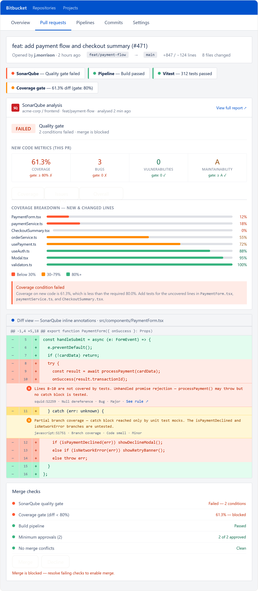
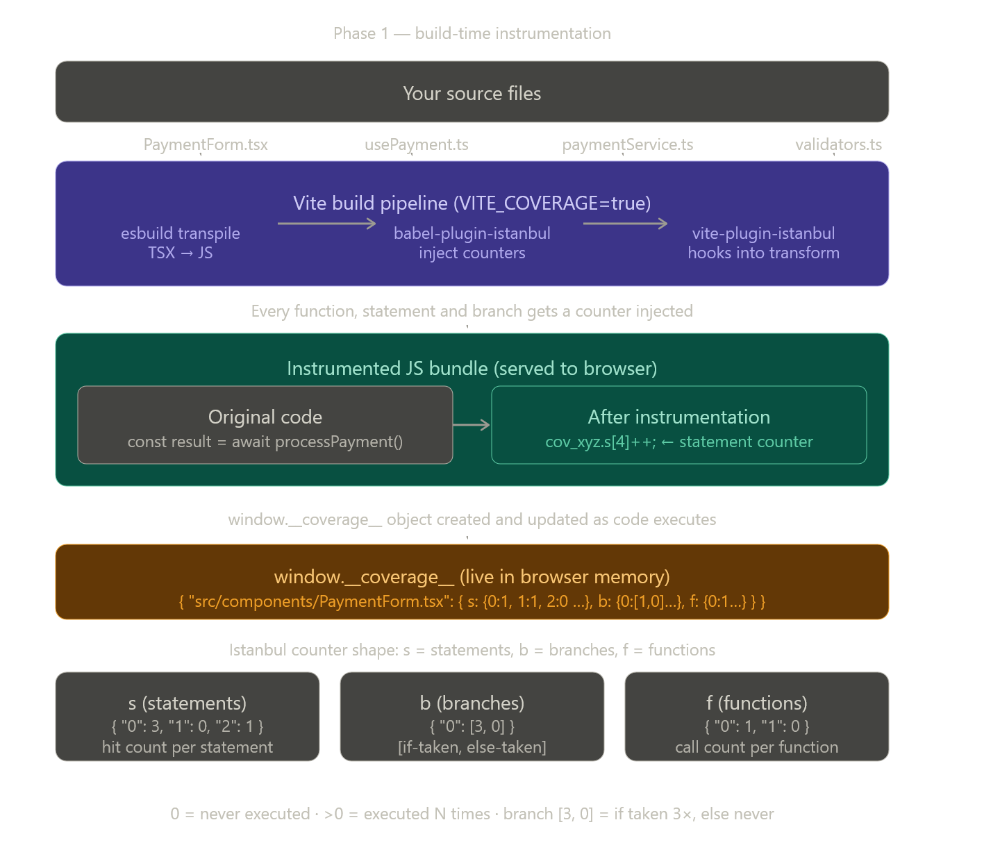
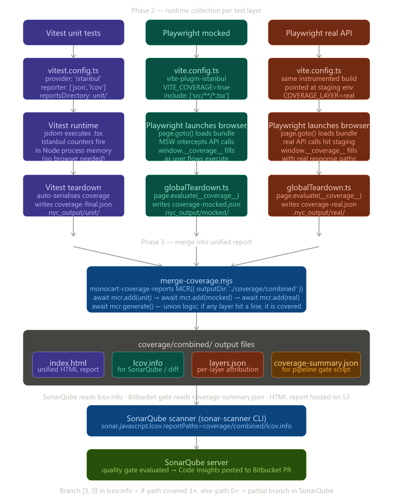

This needs two diagrams: first the instrumentation flow (how coverage counters get into your `.tsx` files at build
time), then the collection and merge pipeline (what happens at runtime and after). Let me build both.That is what
happens at build time — your `.tsx` source gets transformed before it ever reaches the browser. Now the runtime
collection and merge pipeline across the three test layers:

