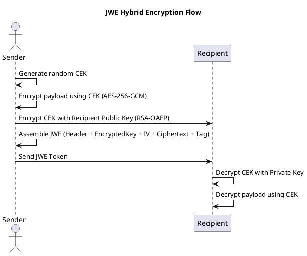

# 🧾 **Architecture Decision Record: Handling Simulated Identity in OAuth2 Requests**

## 📋 **Decision Overview**

| **Category**         | **Details**                                                                |
|----------------------|----------------------------------------------------------------------------|
| **Title**            | Simulated Identity Parameter Strategy                                      |
| **Status**           | Proposed                                                                   |
| **Decision Drivers** | Security, Maintainability, Standards Alignment, Extensibility              |
| **Affected Systems** | Sentry OAuth2/OIDC Authorization Flow, ForgeRock Agents, STS Token Service |

---

## 🎯 **Summary**

To support identity simulation flows, the system must pass a **simulated user identifier (`simulated_id`)** from the
client to Sentry’s authorization endpoint.

This ADR evaluates three design alternatives:

1. **Scope-based embedding**
2. **Separate parameter**
3. **Config-encoded parameter (proposed hybrid)**

After evaluating security, maintainability, and extensibility, the **Config-encoded parameter** approach is recommended.

---

## ⚙️ **Alternatives Considered**

| #     | Approach                                   | Description                                                                                                                                             |
|-------|--------------------------------------------|---------------------------------------------------------------------------------------------------------------------------------------------------------|
| **1** | **Scope-based embedding**                  | Include `simulated_id` as part of the `scope` (e.g., `scope=openid simulate:<encrypted_id>`).                                                           |
| **2** | **Separate parameter**                     | Add a new `simulated_id` field alongside existing OAuth2 parameters.                                                                                    |
| **3** | **Config-encoded parameter (recommended)** | Introduce a single `config` parameter that encodes simulation-related attributes (e.g., `simulated_id`, `alias_id`) as a Base64URL-encoded JSON object. |

---

## 🔍 **Comparison**

### **Technical and Functional**

| **Aspect**                      | **Scope-Based**                   | **Separate Param**                         | **Config-Encoded (Recommended)**                  |
|---------------------------------|-----------------------------------|--------------------------------------------|---------------------------------------------------|
| **Standards Alignment**         | ❌ Misuses scope semantics         | ⚠️ Custom param (non-standard but allowed) | ✅ Compliant OAuth2 extension                      |
| **Implementation Simplicity**   | ⚠️ Requires parsing logic         | ✅ Simple validation                        | ⚠️ Requires encoding/decoding                     |
| **Extensibility**               | ❌ Limited — scope grows unbounded | ❌ Each new field needs a new param         | ✅ Easily add new config fields                    |
| **Caching & STS Compatibility** | ✅ Existing scope caching          | ❌ Requires Redis schema update             | ⚠️ Cache decoded payload                          |
| **Debugging**                   | ❌ Opaque and cluttered            | ✅ Readable logs                            | ⚠️ Requires decoding step                         |
| **Security Boundary**           | ❌ Mixed with non-permission data  | ✅ Isolated field                           | ✅ Encrypted `simulated_id`, minimal exposure      |
| **Auditability**                | ❌ Poor visibility                 | ✅ Explicit in logs                         | ✅ Config easily logged (without sensitive values) |

---

## 🔐 **Security Considerations**

| **Threat**                  | **Risk**                         | **Mitigation**                                                   |
|-----------------------------|----------------------------------|------------------------------------------------------------------|
| **MITM tampering**          | Attacker modifies `simulated_id` | All traffic over HTTPS + encrypted `simulated_id`                |
| **Parameter injection**     | Attacker adds fake `config`      | Whitelist allowed params; validate signature                     |
| **Sensitive data exposure** | Logs contain raw identifiers     | Only `simulated_id` encrypted; `alias_id` stored as plain string |
| **Replay or forgery**       | Reuse of valid config            | Optional JWS signature for config payload integrity              |

---

## 🧩 **Example Implementations**

### **Option 1: Scope-Based**

```
GET /authorize?
 client_id=admin-tool&
 scope=openid profile simulate:EncryptedSimID123&
 response_type=code&
 state=xyz123
```

---

### **Option 2: Separate Parameter**

```
GET /authorize?
 client_id=admin-tool&
 scope=openid profile&
 simulated_id=EncryptedSimID123&
 response_type=code&
 state=xyz123
```

---

### **Option 3: Config-Encoded (Recommended)**

```
GET /authorize?
 client_id=admin-tool&
 scope=openid profile email&
 config=eyJzaW11bGF0ZWRfaWQiOiAiRW5jcnlwdGVkU3RyaW5nIiwgImFsaWFzX2lkIjogImJvYmJ5LWFsaWFzLTEyMyJ9&
 response_type=code&
 state=xyz123
```

Decoded JSON:

```json
{
  "simulated_id": "<EncryptedValue>",
  "alias_id": "bobby-alias-123"
}
```

---


## ⚖️ **Decision Rationale**

| **Factor**                         | **Weight** | **Preferred Option** |
|------------------------------------|------------|----------------------|
| Standards Alignment                | High       | ✅ Config             |
| Maintainability                    | High       | ✅ Config             |
| Security & Auditability            | High       | ✅ Config             |
| Implementation Complexity          | Medium     | ⚠️ Separate Param    |
| Compatibility with Existing Scopes | Medium     | ⚠️ Scope             |
| Extensibility                      | High       | ✅ Config             |

**Summary:**

* The `config` parameter **encapsulates extension data cleanly**, without violating OAuth2 semantics.
* It supports **encrypted sensitive data** and **readable auxiliary fields** (like `alias_id`).
* It scales better than adding multiple top-level parameters.

---

## 🚀 **Implementation Plan**

| **Phase**                 | **Activities**                                           | **Deliverables**            |
|---------------------------|----------------------------------------------------------|-----------------------------|
| **1. Foundation**         | Update OIDC contract; implement config param parser      | Updated API spec & schema   |
| **2. Integration**        | Extend Redis session cache; modify token exchange        | Working end-to-end flow     |
| **3. Security Hardening** | Encrypt `simulated_id`; sign config payload              | Secure and validated config |
| **4. Rollout**            | Update SDKs and client docs; deprecate scope-based usage | Adopted new standard        |

---


## ✅ **Final Recommendation**

> **Adopt the Config-encoded parameter approach**.
> This design isolates simulation data from permission scopes, supports encrypted and unencrypted
> attributes (`simulated_id`, `alias_id`), and aligns with OAuth2 extension best practices.
> It offers a scalable, secure, and auditable foundation for future authorization-context extensions.

# 🧾 ADR: JWE Hybrid Encryption Using CEK and Recipient Public Key

**Status:** Accepted
**Date:** 2025-10-25

---

### **Context**

We need to securely transmit sensitive payloads.
Asymmetric encryption ensures safe key exchange, while symmetric encryption offers performance for large payloads.

---

### **Decision**

Adopt **JSON Web Encryption (JWE)** using a **hybrid encryption model**:

1. Generate a random **Content Encryption Key (CEK)**.
2. Encrypt payload with CEK (**AES-256-GCM**).
3. Encrypt CEK with recipient’s **public key** (**RSA-OAEP**).
4. Package result into a JWE Compact Serialization (five dot-separated parts).
    ```
    BASE64URL(Protected Header)
    .
    BASE64URL(Encrypted Key)
    .
    BASE64URL(IV)
    .
    BASE64URL(Ciphertext)
    .
    BASE64URL(Authentication Tag)
    ```

**JWE Structure:**

| **Field**       | **Description**                                | **Example Algorithm**                |
| --------------- | ---------------------------------------------- | ------------------------------------ |
| `protected`     | Header defining algorithms                     | `{"alg":"RSA-OAEP","enc":"A256GCM"}` |
| `encrypted_key` | CEK encrypted with recipient public key        | RSA-OAEP output                      |
| `iv`            | Initialization vector for symmetric encryption | 96-bit random                        |
| `ciphertext`    | Payload encrypted with CEK                     | AES-256-GCM ciphertext               |
| `tag`           | Authentication tag for integrity               | GCM tag                              |


---

### **PlantUML – Encryption Flow**



---

### **Example**

#### 🔹 **Before Encryption**

```json
{
  "user": "ahmed.hanie",
  "role": "engineer",
  "exp": 1735096200
}
```

#### 🔹 **After Encryption (JWE Compact Form — 5 Parts)**

```
eyJhbGciOiJSU0EtT0FFUCIsImVuYyI6IkEyNTZHQ00ifQ.
OKOawDo13gRp2ojaHV7LFpPqV8iYyZ7T3NDW7A5Sf0bPBOh5DC.
48V1_ALb6US04U3b.
5eym8YV7P09xu9nICh7O4g.
XFBoMYUZodetZdvTiFvSkQ
```

