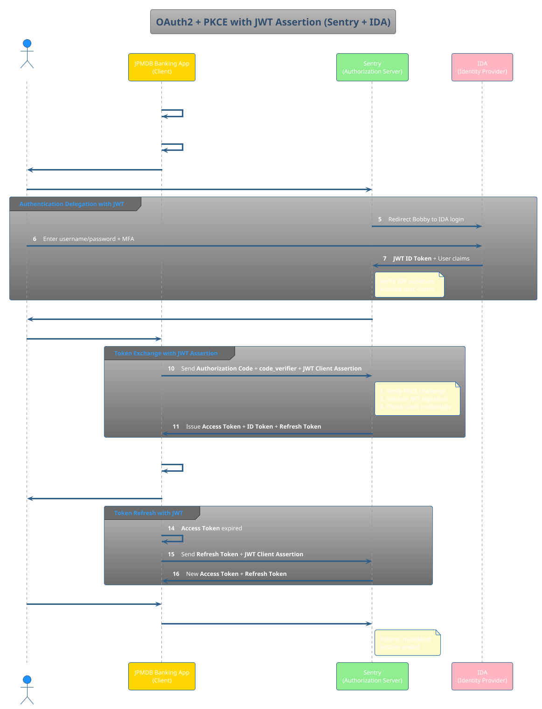

# OAuth2 + PKCE Flow with Sentry and IDA

## 1. Overview

**OAuth 2.0** is a standard for **delegated authorization** that allows an App (client) to access a user's resources
without knowing their password.

**PKCE (Proof Key for Code Exchange)** is an extra security layer that prevents attackers from using stolen
authorization codes.

**JWT Assertion** adds client authentication using signed JSON Web Tokens, providing an additional layer of security
beyond basic client credentials.

** Simple Flow:**

1. Client generates a `code_verifier` and derives a `code_challenge`
2. Client creates **JWT assertion** signed with its private key
3. User is redirected to Authorization Server with `code_challenge`
4. User authenticates with IDP
5. Authorization Server issues **authorization code**
6. Client exchanges **authorization code** + `code_verifier` + **JWT assertion** for **access token**

---

## 2. PlantUML Sequence Diagram with JWT Assertion

---

## 3. Key Concepts

| Concept                           | Definition / Usage                                                                                    |
|-----------------------------------|-------------------------------------------------------------------------------------------------------|
| **Authorization Server (Sentry)** | Issues tokens after authenticating user via IDP and validating client JWT assertions                  |
| **Identity Provider (IDP / IDA)** | Authenticates user credentials and returns JWT ID tokens with user claims                             |
| **Client (Banking App)**          | Application requesting access; uses JWT assertions for secure client authentication                   |
| **Authorization Code**            | Temporary code proving user authentication                                                            |
| **Access Token**                  | Token used to access protected APIs/resources                                                         |
| **ID Token**                      | **JWT** containing user identity claims from IDP, signed by IDP private key                           |
| **Refresh Token**                 | Token allowing client to get new access tokens without re-login                                       |
| **code_verifier**                 | Secret random string generated by client for PKCE                                                     |
| **code_challenge**                | Hashed version of code_verifier sent to authorization server                                          |
| **JWT Client Assertion**          | **Signed JWT** containing client credentials, used instead of client_secret for secure authentication |
| **JWT ID Token**                  | **Signed JWT** from IDP containing user identity information                                          |

---