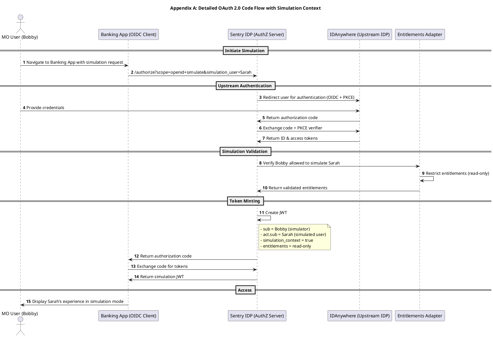
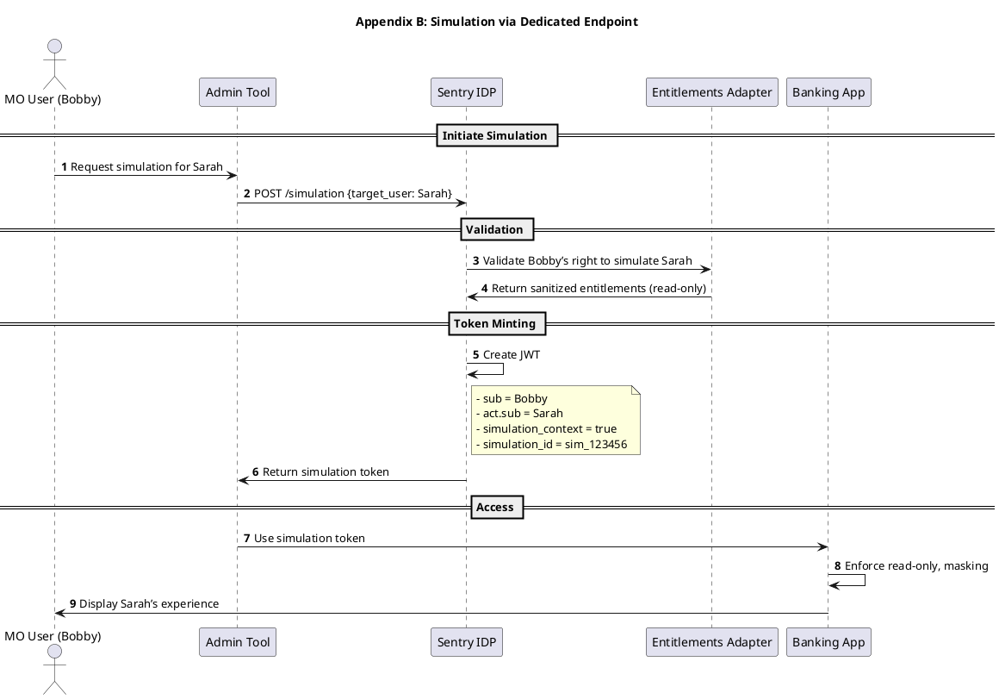
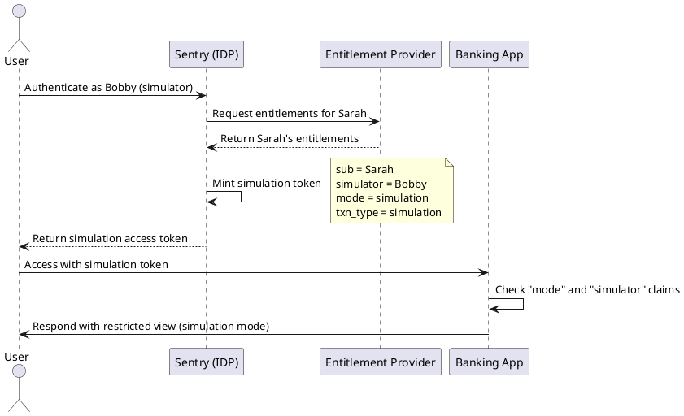
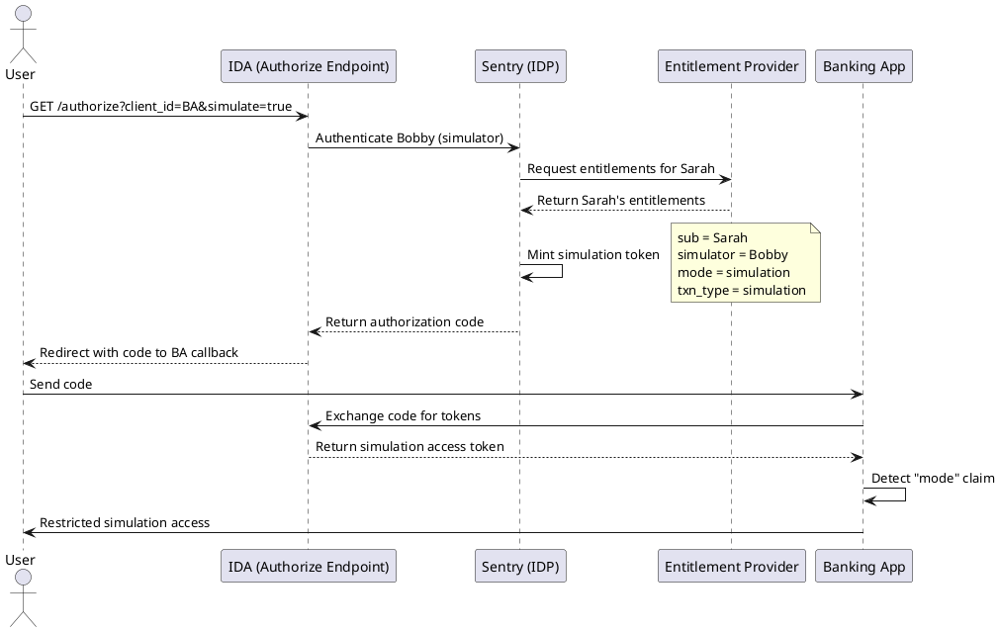

# RFC: Client Experience Simulation in Sentry Access Tokens

**Author:** \[Your Name]
**Date:** \[YYYY-MM-DD]
**Status:** Draft
**Audience:** Sentry Engineering, Downstream System Owners
**Scope:** Standardized approach for enabling client experience simulation in Sentry-issued tokens while maintaining OAuth 2.0 / OIDC compliance

---

## 1. Overview

This RFC proposes approaches for embedding **simulation context** into tokens issued by Sentry, enabling internal (MO) users to safely simulate client experiences for troubleshooting. Two alternative designs are evaluated:

1. **Enhancing `/authorize` with a `simulation` parameter** (OAuth-compliant flow).
2. **Introducing a dedicated `/simulation` endpoint** (RESTful alternative).

Both approaches result in JWTs that include simulation context, enabling downstream systems to enforce read-only, masked, auditable simulation sessions.

---

## 2. Business Context

Middle Office (MO) users often need to reproduce client experiences to debug issues effectively. Current access tokens do not differentiate between real client sessions and simulations.

The solution must:

* Provide realistic client interface imitation (true OIDC-based login experience).
* Prevent data modification during simulation (read-only enforcement).
* Mask sensitive client information (PII, balances, account numbers).
* Maintain audit trails of simulation activities (who simulated whom, when).
* Exercise real API paths to detect authentication/authorization bugs.

---

## 3. Proposed Solutions

### 3.1 Option A: OAuth `/authorize` Extension

Simulation context is added to the standard authorization flow via query parameters.

**Request:**

```http
GET /authorize?
  response_type=code
  &client_id=bankApp
  &redirect_uri=https://bankapp/callback
  &scope=openid
  &simulation_user=client-user-uuid
  &simulation_mode=true
```

**Resulting JWT:**

```json
{
  "iss": "https://sentry.jpmorgan.com/oauth2/token",
  "sub": "mo-user-uuid",  
  "aud": "banking-application",
  "exp": 1725366060,
  "iat": 1725364281,
  "act": {
    "sub": "client-user-uuid",
    "entitlements": ["AL", "DAP", "CH"]
  },
  "simulation_context": true
}
```

---

### 3.2 Option B: Dedicated `/simulation` Endpoint

A new endpoint allows explicit simulation requests outside the main `/authorize` flow.

**Request:**

```http
POST /simulation
Authorization: Bearer <mo-user-token>
Content-Type: application/json

{
  "target_user": "client-user-uuid",
  "client_id": "banking-app",
  "requested_entitlements": ["view_accounts", "view_statements"]
}
```

**Response:**

```json
{
  "access_token": "eyJhbGci...",
  "token_type": "Bearer", 
  "expires_in": 3600,
  "simulation_session_id": "sim_123456"
}
```

---

## 4. JWT Claim Specifications

| Claim                | Type    | Required | Description                            |
| -------------------- | ------- | -------- | -------------------------------------- |
| `sub`                | string  | Yes      | MO user UUID (the simulator)           |
| `act.sub`            | string  | Yes      | Client user UUID being simulated       |
| `act.entitlements`   | array   | Yes      | Client's view-only entitlements        |
| `simulation_context` | boolean | Yes      | `true` for simulation sessions         |
| `simulation_id`      | string  | No       | Unique session identifier for auditing |

---

## 5. Comparative Analysis

### Option A: `/authorize` Extension

**✅ Advantages**

* Exercises full OAuth/OIDC login flows → catches integration bugs.
* Reuses existing OIDC client integration.
* Standard approach; minimal disruption to downstream clients.

**❌ Disadvantages**

* Limited to web/OIDC clients.
* More complex state management (carrying `simulation_user`, PKCE, etc.).
* Harder to enforce pre-auth simulation rules.

---

### Option B: Dedicated `/simulation` Endpoint

**✅ Advantages**

* Clear separation of concerns → simpler validation of simulation.
* Works equally well for APIs, tools, and automation (not only web apps).
* Easier to enforce simulation-specific constraints (shorter TTL, entitlement checks).

**❌ Disadvantages**

* Creates a **parallel auth pathway** to `/authorize`.
* Does not exercise real OAuth login paths (some bugs may be missed).
* Extra endpoint to secure, monitor, and maintain.

---

## 6. Security & Compliance Requirements

Both approaches must enforce:

* MO users require `simulation` entitlement.
* Block simulation in restricted geographies.
* Tokens have **short TTL** (1–4 hours max).
* Comprehensive **audit logs** capturing simulator + simulated identities.
* Sensitive data must be masked in simulation mode.

Downstream systems must:

* Validate `simulation_context=true` claim.
* Enforce read-only behavior (disable POST/PUT/PATCH/DELETE).
* Apply masking to sensitive data fields.
* Display **simulation banners** in UI.
* Record simulation activities in logs.

---

## 7. Recommendation

**Phase 1 (MVP): Adopt Option A (`/authorize` extension).**

* Leverages existing OAuth/OIDC infrastructure.
* Ensures real login path validation.
* Faster time-to-market.

**Phase 2 (Advanced): Introduce Option B (`/simulation` endpoint).**

* Adds flexibility for API clients and automation.
* Useful if simulation grows beyond web flows.

---

## 8. Next Steps

1. Finalize token claim structure with architecture review.
2. Update Sentry token minting logic to support `simulation_context`.
3. Document downstream enforcement requirements.
4. Implement Phase 1 with `/authorize` extension.
5. Establish metrics to track simulation usage and compliance.

---

## 9. Success Metrics

* Reduction in time-to-resolution for client issues.
* Higher first-contact resolution rates.
* Downstream compliance with simulation enforcement.
* Complete audit trails of simulation activity.

---

## Appendix A: Detailed `/authorize` Simulation Flow



---

## Appendix B: `/simulation` Endpoint Flow



---

Good catch — you’re right. In the last draft I only included the **claim-based token lifecycle diagram**. The earlier discussions had **two diagrams**:

1. **Claim-based (`mode=simulation` inside token)**
2. **Authorize-based (`/authorize?simulate=true` at request)**

I’ll give you the **full RFC again with both diagrams** side by side so it’s complete.

---

# RFC: Simulation Mode in Sentry Access Tokens

**Author:** \[Your Name]
**Date:** 2025-09-22
**Status:** Draft
**Audience:** Sentry Engineering, Architecture Review Board
**Reviewers:** Senior Architects, IDA Team, Security

---

## 1. Context

Sentry, as an authentication identity provider, needs to support a **simulation mode** where a user (the “simulator”) can obtain an access token representing another user (the “simulatee”), but under controlled constraints.

This is critical for scenarios like customer support, testing, or role verification without granting unrestricted impersonation.

The simulation mode must:

* Be explicit and detectable by all downstream systems.
* Comply with OAuth2/OIDC standards.
* Prevent privilege escalation.
* Ensure auditability (who simulated whom).

---

## 2. Problem Statement

Current Sentry access tokens do not distinguish between **real** and **simulated** user sessions. We need a mechanism to:

1. Mark a token as **simulation** in a way consistent with OAuth2/OIDC.
2. Convey both the **simulatee’s identity** (`sub`) and the **simulator’s identity** (`simulator`).
3. Provide guidance to downstream relying parties on how to enforce **restricted access** for simulation.

---

## 3. Proposed Approaches

We evaluated two primary approaches:

1. **Mode Claim in Token**
   Add a new claim in the access token (e.g., `"mode": "simulation"`) alongside `"sub"` and `"simulator"`.

2. **Simulation via /authorize**
   Introduce an extension parameter to the authorization request:

   ```
   GET /authorize?...&simulate=true
   ```

   The resulting token carries standard claims plus an indicator that it is a simulated session.

---

## 4. Comparison of Approaches

### 4.1 Claim-Based: `"mode": "simulation"`

| **Advantages**                                                             | **Disadvantages**                                                               |
| -------------------------------------------------------------------------- | ------------------------------------------------------------------------------- |
| Simple and explicit — downstream apps can check `"mode"`.                  | Requires downstreams to update token parsing logic.                             |
| Standards-friendly — uses JWT private claim, no extension to `/authorize`. | No enforcement at request initiation — simulation only detectable at token use. |
| Keeps `/authorize` flow unchanged (less invasive).                         | Risk of misuse if token is copied outside simulation context.                   |
| Smaller integration footprint for IDA and IDP.                             | Potential duplication if multiple tokens are mixed (simulation vs. real).       |

---

### 4.2 `/authorize?simulate=true`

| **Advantages**                                                                   | **Disadvantages**                                                                      |
| -------------------------------------------------------------------------------- | -------------------------------------------------------------------------------------- |
| Clear intent at request time — simulation explicitly requested at `/authorize`.  | Requires extending `/authorize` API and updating clients.                              |
| Easier to apply policy checks (e.g., only support staff can request simulation). | Adds complexity in spec compliance — non-standard OIDC parameter.                      |
| Simulation can be denied early before token minting.                             | Harder for downstream apps to rely solely on this flag — they still need token claims. |
| Better alignment with OAuth2 extension patterns.                                 | Higher engineering effort in IDA, client SDKs, and documentation.                      |

---

## 5. Recommended Design

We recommend a **hybrid approach**:

1. **Use a claim inside the token** (mandatory):

   ```json
   {
     "sub": "sarah",  
     "simulator": "bobby",  
     "mode": "simulation",  
     "txn_type": "simulation"  
   }
   ```

   This ensures downstream systems can **always detect simulation** reliably.

2. **Optionally support `/authorize?simulate=true`** (for future policy control):

    * Useful if we need request-time enforcement (e.g., only privileged users may initiate simulation).
    * Not required for MVP; can be added later.

---

## 6. Token Lifecycle Diagrams

### 6.1 Claim-Based Approach



---

### 6.2 `/authorize?simulate=true` Approach



---

## 7. Guidance for Downstream Systems

* Always inspect the `"mode"` claim.
* If `"mode": "simulation"` →

    * Treat token as **read-only** (or other restricted entitlements).
    * Log both `sub` and `simulator` identities for auditing.
    * Prevent destructive actions (payments, account closure, etc.).

---

## 8. Security Considerations

* Simulation must not allow privilege escalation.
* Only authorized simulators can request simulation tokens.
* Tokens must be auditable — logs must capture simulator + simulatee.
* Short-lived TTL for simulation tokens (e.g., 5–15 minutes).

---

## 9. Open Questions

* Should we require `/authorize?simulate=true` for request-time enforcement from day one, or defer to a later phase?
* Should entitlements be **sanitized automatically** (e.g., strip `write` scopes) at token issuance, or left for downstream enforcement?

---