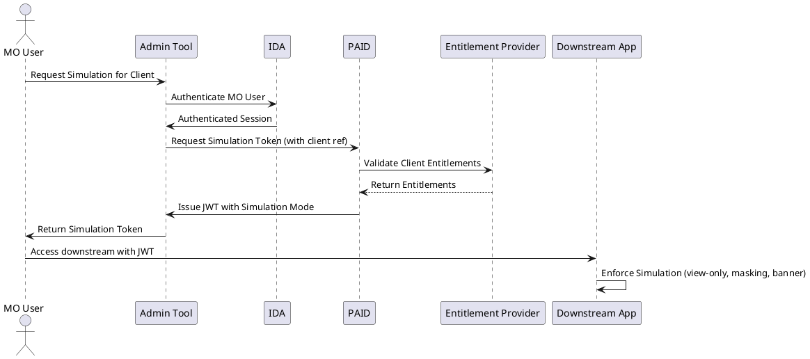

# RFC: Client Experience Simulation Mode in PAID Access Tokens

## 1. Overview

This RFC proposes a standardized method for embedding **client experience simulation context** into access tokens issued by PAID.
The feature enables J.P. Morgan employees (Service Representatives, Bankers, and Middle Office staff) to realistically simulate client experiences while ensuring:

* **Security:** No modifications to client data
* **Compliance:** Data masking and restricted countries
* **Clarity:** Clear simulation markers in JWTs
* **Standards alignment:** OAuth 2.0 and JWT compliance

---

## 2. Problem Statement

Currently, MO users lack visibility into what clients experience, making troubleshooting inefficient. Downstream applications cannot distinguish between:

* A standard client session
* A simulated session initiated by an internal MO user

This RFC introduces a standardized claim to differentiate simulation tokens, enabling downstream systems to enforce appropriate behavior.

---

## 3. Proposed Solution

### 3.1 Token Structure Enhancement

PAID will enhance its JWTs to include simulation context via a **custom namespaced claim**:

```json
{
  "iss": "https://PAID.company.com/oauth2/token",
  "sub": "mo-user-uuid",                  // MO user (internal actor)
  "aud": "downstream-application",
  "exp": 1725366060,
  "iat": 1725364281,

  "act": {
    "sub": "client-user-uuid",            // Client being simulated
    "entitlements": ["AL", "DAP", "CH"]   // Extracted client entitlements
  },

  "https://PAID.company.com/mode": "simulation"
}
```

### 3.2 Claim Definitions

* **`sub`**: MO user initiating simulation
* **`act` (Actor claim, RFC 8693)**:

    * `sub`: Client being simulated
    * `entitlements`: Entitlements as retrieved from external entitlement provider
* **`https://PAID.company.com/mode`**: Simulation flag

    * `"simulation"` → Client experience simulation
    * `"production"` (default) → Normal sessions

---

## 4. Authentication & Token Flow

### 4.1 Flow Steps

1. MO user logs in via **IDA** and requests simulation.
2. PAID fetches client entitlements from external provider.
3. PAID mints **Simulation Token** with simulation claim.
4. MO user uses token to access downstream applications.
5. Downstream systems enforce simulation rules (view-only, masking, banners).

---

### 4.2 Sequence Diagram



---

## 5. Downstream System Requirements

Systems receiving a token with `"https://PAID.company.com/mode": "simulation"` must:

1. **Restrict Actions**

    * Allow: `GET`, export, view balances/reports/statements
    * Block: `POST`, `PUT`, `PATCH`, `DELETE`
    * Exception: temporary draft save allowed

2. **Mask Sensitive Data**

    * Hide SSNs, account numbers, passwords
    * Replace with masked placeholders

3. **Display UI Indicators**

    * Persistent simulation banner on all pages

4. **Enhanced Logging**

    * Capture both simulating user (`sub`) and simulated client (`act.sub`)

---

## 6. Security Considerations

* Simulation tokens have **shorter TTLs** (≤ 30 minutes).
* All tokens remain signed with RS256 and validated as per RFC 8725.
* Simulation activity is fully auditable in both PAID and downstream logs.
* Restricted-country clients (Japan, Korea, Luxembourg, Malaysia, Taiwan) must be excluded.

---

## 7. Compliance

This approach complies with:

* OAuth 2.0 Token Exchange (RFC 8693) for delegation via `act` claim
* JWT BCP (RFC 8725) for secure claim usage
* Organizational security standards for entitlements and masking

---

## 8. Next Steps

1. Confirm claim naming convention with Architecture (default: `https://PAID.company.com/mode`)
2. Update PAID token minting logic to add simulation mode
3. Publish downstream enforcement guidelines (sample code + banner UI spec)
4. Rollout in phases with pilot downstream applications

---
