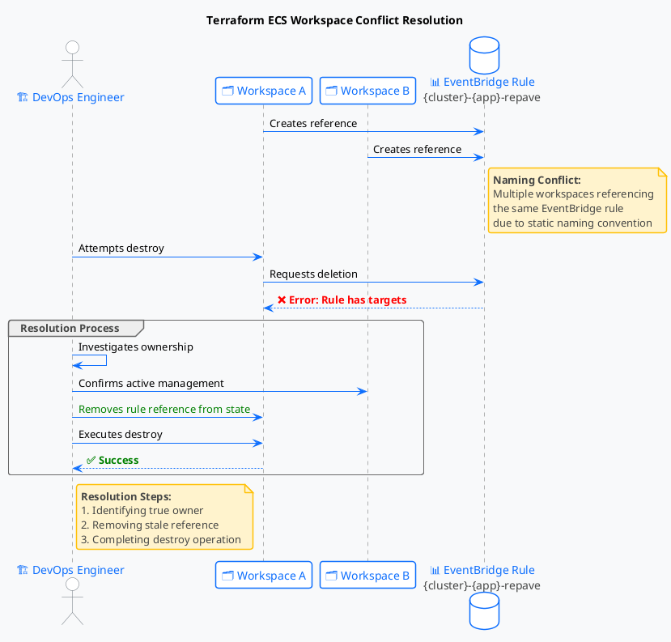

### **Document Title: Resolving Terraform EventBridge Rule Conflicts**

**Status:** Approved
**Last Updated:** [Date]

---

#### **Problem Description**
When attempting to destroy Terraform workspaces, the operation fails with:
```
Error: deleting EventBridge Rule (login-ui-login-service-repave): 
ValidationException: Rule can't be deleted since it has targets.
```

**Root Cause:** The EventBridge rule naming convention (`{cluster_name}-{app_name}-repave`) caused multiple workspaces to reference the same AWS resource. While the actual resource was managed by one workspace (`login-service-terraform-region`), a stale workspace still claimed ownership in its state file.

#### **Solution Summary**
Remove the incorrect EventBridge rule reference from the state file of the workspace being destroyed.

#### **Step-by-Step Resolution**

1.  **Identify Ownership**
    Verify which workspace actually manages the rule (in this case, `login-service-terraform-region`).

2.  **Secure the State File**
    ```bash
    terraform state lock          # Prevent concurrent access
    terraform state pull > state.json  # Download current state
    cp state.json state.json.backup    # Create backup
    ```

3.  **Edit the State File**
  - Locate and remove the `aws_cloudwatch_event_rule` resource block
  - Increment the `serial` value by 1

4.  **Apply Changes**
    ```bash
    terraform state push state.json  # Upload modified state
    terraform state unlock           # Restore access
    ```

5.  **Complete Destruction**
    ```bash
    terraform destroy -var-file="variables/sandbox-uat.tfvars"
    ```


#### **Key Points**
- **Cause:** Static naming convention (`{cluster_name}-{app_name}-repave`) caused state conflicts
- **Solution:** State surgery to remove incorrect references
- **Prevention:** Ensure only one workspace manages each unique rule
- **Caution:** Always backup state files before manual edits


