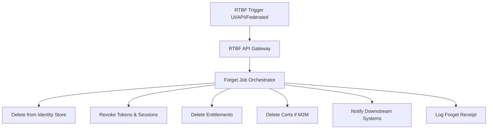
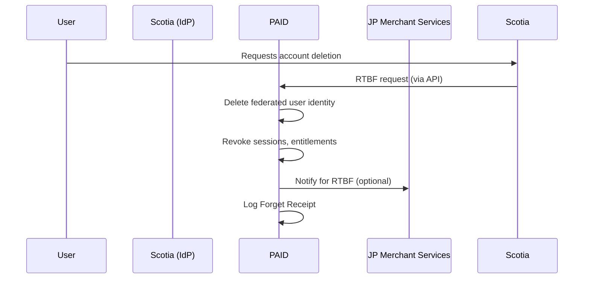
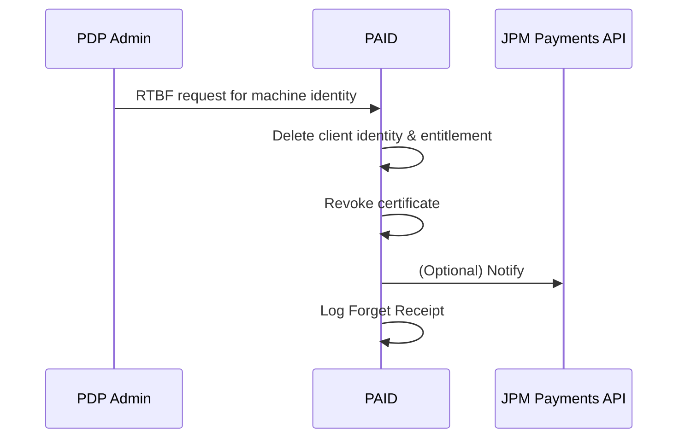
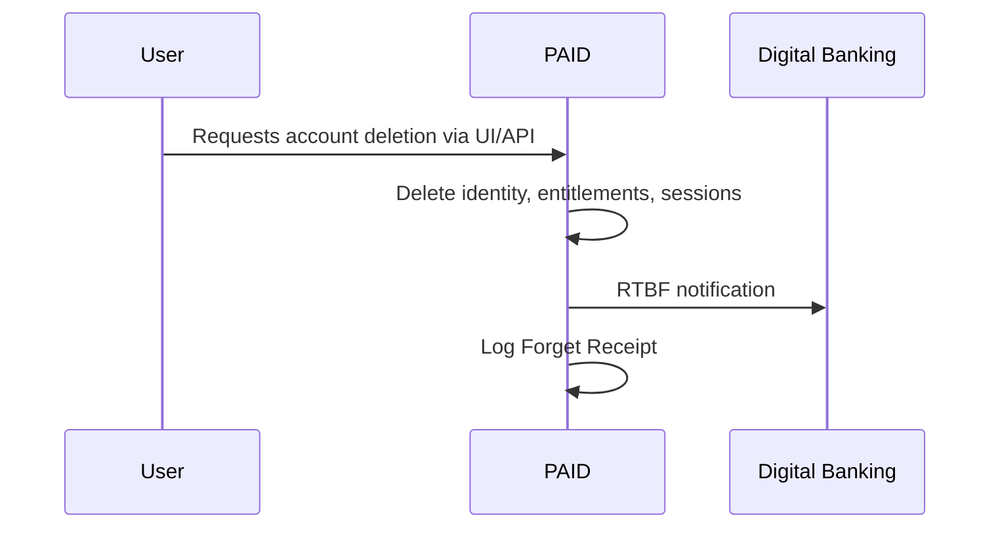
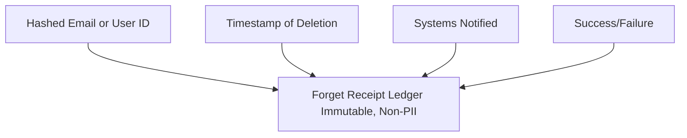

# PAID Platform: Right to Be Forgotten (RTBF) Orchestration Design RFC

## 1. Overview

This RFC outlines the strategy for implementing the Right to Be Forgotten (RTBF) across the PAID Identity Access Management platform. The approach applies to three key identity flows: inbound federation, machine-to-machine authentication, and OAuth-based user access. The design opts for **hard deletion** of identity records while retaining **decoupled audit logs** to satisfy regulatory compliance (e.g., GDPR, CCPA).

## 2. Goals

* Fully delete user or client identity data from PAID while retaining non-PII audit logs.
* Provide consistent RTBF behavior across identity types and authentication flows.
* Ensure downstream systems can be notified of deletions.
* Maintain legal compliance (GDPR Art. 17, CCPA §1798.105).

## 3. Scope of Identity Types and Use Cases

### 3.1 Inbound Federation (e.g., Scotia Bank -> JP Merchant Services)

* **Identity Type:** Federated human user
* **Flow:** SAML or OIDC federation initiated by external IdP
* **RTBF Trigger:** Request received via federated IdP (e.g., Scotia)

### 3.2 Machine-to-Machine (e.g., PDP -> Payments API)

* **Identity Type:** Client/machine identity using mTLS
* **Flow:** Certificate-based authentication to access JPM payments API
* **RTBF Trigger:** PDP client revokes access or requests deletion

### 3.3 Direct Registration & OAuth (e.g., PAID -> Digital Banking)

* **Identity Type:** Native human user
* **Flow:** OAuth2 login to access protected JPM services
* **RTBF Trigger:** User-initiated deletion via UI or DSR API

## 4. RTBF Architecture

### 4.1 RTBF API Gateway

* **Endpoint:** `DELETE /identities/{user_id}` or `DELETE /dsr-request`
* **AuthN/AuthZ:** Ensures valid request (user token, client credentials, or federated assertion)
* **Output:** Creates a "Forget Job" in the queue

### 4.2 Forget Job Orchestrator

* Stateless service that:

    * Identifies identity type and routing logic
    * Deletes user/client data from:

        * Core identity store
        * Token/session store
        * Entitlement service
        * Certificate registry (for machines)
    * Triggers notifications to registered downstream systems
    * Records RTBF status in audit ledger

### 4.3 Forget Receipt Ledger

* Append-only audit log (non-PII)
* Stores:

    * Hashed user ID or email
    * Timestamp
    * Systems notified
    * Job outcome (e.g., success, partial failure)

### 4.4 Downstream Notification Framework

* Pluggable hooks for:

    * Digital Banking
    * JP Merchant Services
    * PDP or other registered clients
* Supports REST callbacks, Kafka topics, or internal events

## 5. Flow Diagrams

### 5.1 RTBF Flow Orchestrator (Generic Architecture)

### 5.2 Federated RTBF (Inbound Federation)

### 5.3 M2M RTBF (PDP)

### 5.4 OAuth RTBF (Digital Banking)

### 5.5 RTBF Receipt Ledger (Audit View)

## 6. Compliance Considerations

* **Hard deletion** is used to eliminate the need for filtering soft-deleted users in all flows.
* Audit logs are retained with **hashed identifiers** to ensure non-relinkability.
* RTBF receipts support external compliance validation and internal audits.

## 7. Implementation Notes

* Add identity-type field in user metadata to support routing logic.
* Implement retry and timeout logic for downstream notification failures.
* Build a secure audit viewer for internal compliance team.

## 8. Future Enhancements

* Support identity graph resolution (multiple accounts linked to one user)
* Add user-facing receipt viewer
* Export RTBF status via internal compliance dashboard

## 9. References

* [GDPR Art. 17 - Right to erasure](https://gdpr-info.eu/art-17-gdpr/)
* [ICO Guidance on Right to Erasure](https://ico.org.uk/for-organisations/uk-gdpr-guidance-and-resources/individual-rights/right-to-erasure/)
* [NIST SP 800-88 Rev.1 - Guidelines for Media Sanitization](https://nvlpubs.nist.gov/nistpubs/SpecialPublications/NIST.SP.800-88r1.pdf)
