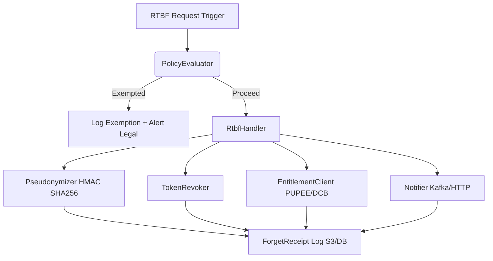
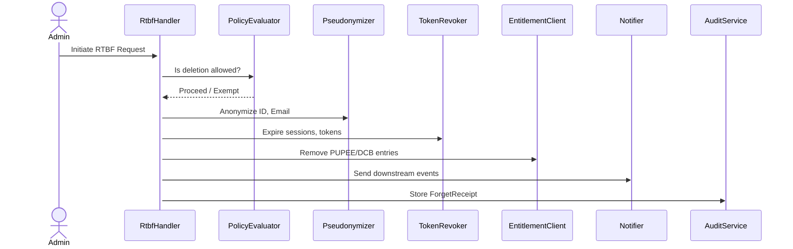

# RFC: Right to Be Forgotten (RTBF) and User Removal in Sentry

## 1. Purpose

This document outlines the architecture, design principles, and phased roadmap for implementing Right to Be Forgotten (RTBF) capabilities in the Sentry identity platform. It aims to meet GDPR, CCPA, and JPMorgan internal compliance needs while ensuring downstream systems receive appropriate revocation signals.

---

## 2. Background

Sentry is an external identity provider platform integrating multiple federated and M2M systems. Currently, there is no formal user deletion or pseudonymization mechanism. This RFC proposes a phased, scalable model to safely remove or anonymize user data while preserving audit trails and regulatory requirements.

---

## 3. Goals

* Enable pseudonymization and soft deletion of identity data
* Ensure entitlements are revoked in PUPEE/DCB
* Support legal and compliance-driven exemption checks
* Track and log each RTBF action for audit
* Lay the groundwork for downstream integration

---

## 4. Core Design Principles

| Principle                 | Description                                                |
| ------------------------- | ---------------------------------------------------------- |
| **Pseudonymize > Delete** | Prefer soft deletion to maintain auditability              |
| **Exemption Filtering**   | Legal and AML policies gate RTBF execution                 |
| **Orchestrated Actions**  | Central handler ensures consistency and failure recovery   |
| **Plugin-Friendly**       | Prepare for scalable downstream integrations via interface |
| **Evidence Bundle**       | Store proof of all actions taken (ForgetReceipt)           |

---

## 5. Current State Summary

| Component        | Description                                            |
| ---------------- | ------------------------------------------------------ |
| Users            | Federated (Scotia), outbound SAML, M2M, local users    |
| Entitlements     | PUPEE, DCB (2 systems currently integrated)            |
| Deletion Process | None currently defined                                 |
| Audit Logs       | Retained, not pseudonymized                            |
| Compliance       | No automated legal hold checks or GDPR execution paths |

> **Note:** “No legal hold checks or GDPR pathways” means that Sentry currently lacks built-in workflows to check if a user is under litigation/legal hold or to execute RTBF requests in a structured, compliant way.

---

## 6. Phase 1 Design (MVP)

### 6.1 Architecture Diagram



### 6.2 Data Flow Diagram



---

## 7. Java Design Snippets

### 7.1 Pseudonymization Utility

```java
public class Pseudonymizer {
    private final SecretKey hmacKey;

    public String anonymize(String input) throws Exception {
        Mac mac = Mac.getInstance("HmacSHA256");
        mac.init(hmacKey);
        byte[] hash = mac.doFinal(input.getBytes(StandardCharsets.UTF_8));
        return "anon_" + Base64.getUrlEncoder().withoutPadding().encodeToString(hash);
    }
}
```

> `anon_` is a prefix indicating the value has been pseudonymized. It visually marks anonymized identifiers and helps avoid accidental use as real PII.

### 7.2 Forgettable Plugin Interface

```java
public interface Forgettable {
    ForgetReceipt forgetUser(String userId, RtbfScope scope);
}

public class ForgetReceipt {
    private String system;
    private String action; // DELETE, ANONYMIZE, EXEMPT
    private String proof;
    private Instant timestamp;
}
```

---

## 8. Evidence Logging

A "ForgetReceipt" will be created per system and persisted as a compliance artifact.

```json
{
  "user_id": "usr_91a83",
  "actions": [
    { "system": "PUPEE", "action": "REVOKE", "proof": "jws1..." },
    { "system": "SentryDB", "action": "ANONYMIZE", "proof": "jws2..." }
  ],
  "timestamp": "2025-07-06T09:00:00Z"
}
```

---

## 9. Compliance Considerations

| Scenario                | RFC Approach                                                               |
| ----------------------- | -------------------------------------------------------------------------- |
| Legal Hold (Litigation) | RTBF blocked by PolicyEvaluator; exemption logged and legal notified       |
| AML Flag                | Treated as exempt under regulatory obligation                              |
| Backup Retention        | Will be addressed in Phase 2 using tombstone markers for eventual purge    |
| Audit Data              | Retained in pseudonymized form to preserve forensic and fraud traceability |

> This section clarifies how Sentry remains compliant by avoiding data loss where legally prohibited, while still respecting user deletion rights under valid circumstances.

---

## 10. Success Metrics

* ✅ 100% of RTBF requests processed within SLA
* ✅ Zero PII leakage in retained logs
* ✅ All systems return ForgetReceipt with JWS proof

---

## 11. Future Phases

### Phase 2

* Add downstream system registry
* Retry/resilience engine
* Dashboard visibility

### Phase 3

* Backup tombstone rewrite jobs
* Plugin auto-discovery + receipt chaining

---

## 12. Open Questions

1. **Shadow Tables:** Should we store anonymized IDs alongside originals in a dedicated, secured table to allow joining for reporting?
2. **PUPEE/DCB SLA:** What turnaround time is reasonable and enforceable for entitlement removal?
3. **Federated RTBF:** Do we need legal contracts or APIs with IdPs like Scotia to support RTBF reliably?

> These are decisions that need further alignment with Legal, SRE, and Integration partners before final implementation.

---

## 13. Reviewer Q\&A

### Q1: What is a ForgetReceipt and why do we need it?

**A:** It's a structured, signed record of actions taken during RTBF. It ensures:

* Auditability of RTBF operations
* Proof for compliance reviews
* Ability to retry or troubleshoot failed steps

### Q2: How does the RFC handle users under legal hold or AML review?

**A:** The `PolicyEvaluator` checks exemption sources (e.g. DCB or Legal DB). Exempt users trigger a logged exemption and are excluded from deletion.

### Q3: Why use pseudonymization instead of deletion?

**A:** Pseudonymization retains the record for audit and fraud purposes while masking PII, which aligns with financial regulatory requirements.

### Q4: What happens if PUPEE or a downstream system fails?

**A:** The orchestrator retries the request. After 3 failures, it escalates to SRE. The failure is logged in the ForgetReceipt.

### Q5: How are federated users handled?

**A:** In Phase 1, they are treated like local users. Phase 3 will define protocols to notify or coordinate deletion with federated IdPs.

### Q6: Where are ForgetReceipts stored and how are they secured?

**A:** They are stored in a secure S3 bucket or encrypted DB with RBAC and access logging.

### Q7: How do downstream apps support RTBF?

**A:** They implement the `Forgettable` Java interface to handle deletions/anonymization. Their responses are logged as receipts.

### Q8: How can product owners monitor RTBF?

**A:** A dashboard will be introduced in Phase 2. For now, receipts can be queried via CLI or admin API.

---

## 14. References

* [Stripe GDPR Design](https://stripe.com/docs/security/gdpr)
* [Azure AD PDP](https://learn.microsoft.com/en-us/azure/active-directory/fundamentals/active-directory-gdpr)
* [Auth0 RTBF Docs](https://auth0.com/docs/compliance/gdpr/features/user-deletion)
* [JPMC Internal Compliance](internal-link)
