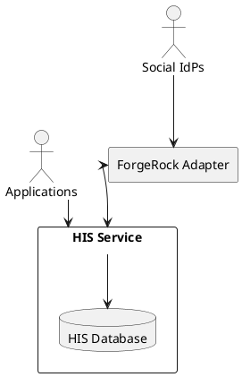
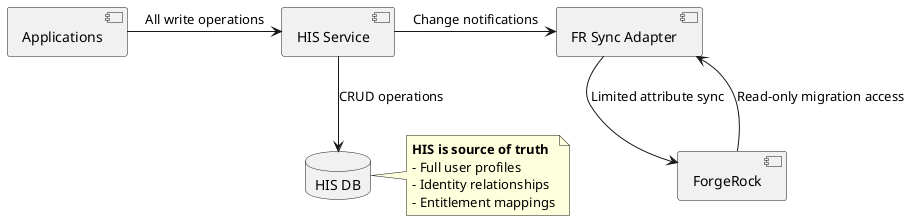
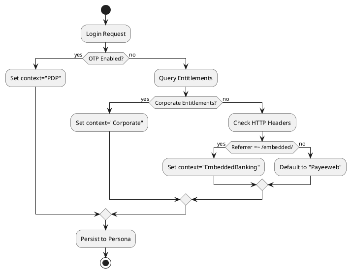
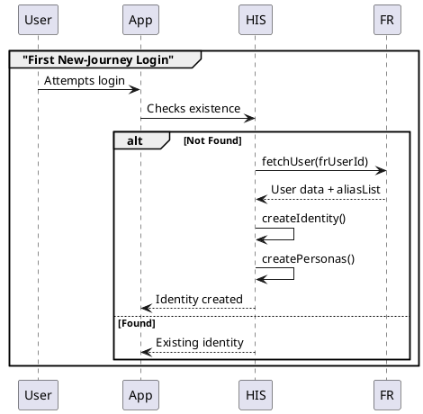
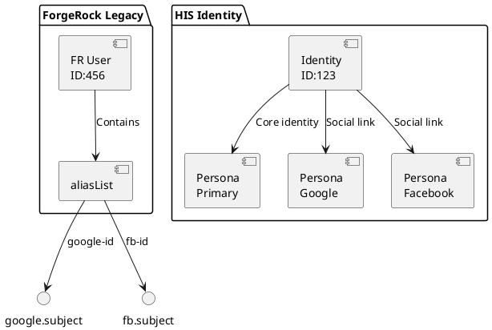
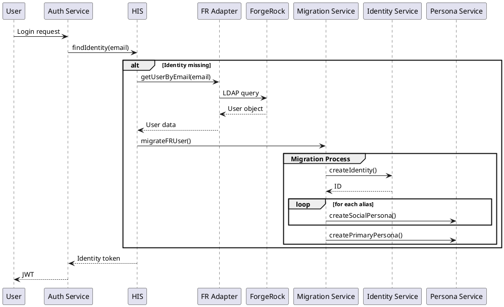

# RFC: Unified Identity Migration from ForgeRock to Human Identity Service (HIS)

## 📚 Table of Contents

* [Goals](#-goals)
* [Problem Statement](#-problem-statement)
* [High-Level Architecture](#-high-level-architecture)
* [Components](#-components)
* [Technical Design](#-technical-design)
* [Migration Phases](#-migration-phases)
* [Success Criteria](#-success-criteria)
* [ADRs Summary](#-adrs-summary)
* [Migration API](#-migration-api)
* [Conflict Resolution](#-conflict-resolution)
* [Migration Checklist](#-migration-checklist)
* [Open Questions](#-open-questions)

---

## 📌 Goals

* Establish HIS as the **single source of truth** for all identity and authentication data.
* Provide **persona-based identity modeling** with contextual entitlements.
* Enable **seamless migration** of users from ForgeRock (FR) to HIS.
* Preserve **identity linkages** across client contexts and social providers.
* Ensure **zero downtime**, data consistency, and forward compatibility.

---

## ❗ Problem Statement

ForgeRock is currently the central identity provider, handling user creation, authentication, and storage. However:

* FR lacks the concept of **personas** and contextual entitlement isolation.
* It cannot **intelligently consolidate** users across social providers.
* FR is a SaaS-managed system, limiting **customization and resilience**.
* **HIS** offers deeper identity modeling, control over data, and supports multi-client identity relationships.

---

## 🔧 High-Level Architecture



---

## 🧩 Components

| Component         | Description                                         |
| ----------------- | --------------------------------------------------- |
| **Identity**      | Global object per user                              |
| **Persona**       | Context-specific view of user (PDP, Embedded, etc.) |
| **Alias**         | Social identity mapping (Google, Facebook)          |
| **FR Adapter**    | Handles interim syncs from FR to HIS                |
| **Migration API** | Just-in-time and batch user migration               |

---

## 🏗️ Technical Design

### Architecture Overview



### Client Context Detection Logic



### Migration Workflow



### Social Account Linking



---

## 🔄 Migration Phases



---

## ✅ Success Criteria

* All active identities created or migrated to HIS.
* All social identities mapped as separate HIS personas.
* No user or entitlement loss during migration.
* Identity APIs updated across client applications.

---

## 📄 ADRs Summary

(ADRs remain unchanged)

---

## ✅ Migration API

`POST /identities/migrate-from-fr`

```json
{
  "frUserId": "uuid",
  "clientContext": "detected/client",
  "migrationType": "SOCIAL|PRIMARY"
}
```

---

## 🔁 Conflict Resolution

```python
def resolve_conflict(his_data, fr_data):
  core_fields = ['email', 'phone']
  for field in core_fields:
    if his_data.get(field) != fr_data.get(field):
      return his_data[field]  # HIS wins

  session_fields = ['lastLogin', 'loginCount']
  for field in session_fields:
    if fr_data.get(field):
      return fr_data[field]  # FR wins for session
```

---

## 🧠 Persona Mapping Table

| Type    | Source      | Example                                   | HIS Persona Type | Notes                      |
| ------- | ----------- | ----------------------------------------- | ---------------- | -------------------------- |
| Primary | FR Email    | [user@domain.com](mailto:user@domain.com) | PRIMARY          | Core login method          |
| Social  | Google ID   | sub: abc123                               | SOCIAL           | Linked via aliasList       |
| Social  | Facebook ID | sub: fb456                                | SOCIAL           | Linked via aliasList       |
| Client  | PDP OTP     | Derived from metadata                     | PDP Persona      | Has OTP / PDP entitlements |

---

## ✅ Migration Checklist

* [ ] HIS service accepts and stores new user registrations
* [ ] Social identities mapped as distinct personas
* [ ] On-the-fly login migration in place
* [ ] Scheduled sync jobs implemented
* [ ] Logging and metrics dashboard ready
* [ ] Conflict handling logic deployed and verified
* [ ] Rollback plan documented and tested
* [ ] All clients integrated with HIS identity APIs

---

## ❓ Open Questions

### ❗ High Priority

| Question                                                                | Impact                           | Owner         |
| ----------------------------------------------------------------------- | -------------------------------- | ------------- |
| How to detect Corporate vs Embedded Banking users without entitlements? | High - affects persona structure | Product Team  |
| Should we allow HIS→FR writebacks for session attributes?               | Medium - sync complexity         | Architecture  |
| Retention period for FR data post-migration                             | Legal/Compliance                 | Security Team |

### ⏳ Longer-Term

| Question                     | Consideration                 | Timeline |
| ---------------------------- | ----------------------------- | -------- |
| Full FR decommissioning      | Cost savings vs fallback need | Q2 2025  |
| Multi-region persona support | Data residency requirements   | Q3 2025  |

---