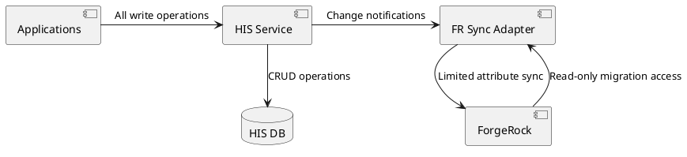
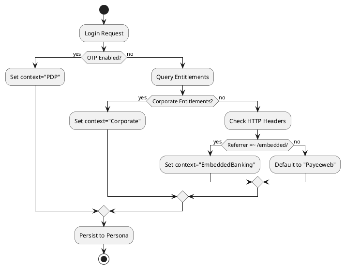
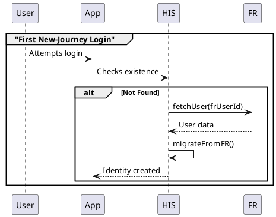
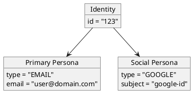

```markdown
# RFC: Unified Identity Migration from ForgeRock to Human Identity Service (HIS)

## Status
**Proposed**  
**Last Updated**: 2023-11-20  
**Owners**: Identity Team  

## 1. Motivation

### Problem Statement
- Dual identity storage in ForgeRock (FR) and HIS creates synchronization challenges
- HIS is designated as the strategic source of truth but lacks legacy user data
- Complex identity linkages (social logins via `aliasList`, multi-client access) require careful migration

### Goals
1. Migrate 100% of users to HIS without service disruption
2. Preserve all identity relationships (social logins, entitlements)
3. Maintain backward compatibility during transition period
4. Establish HIS as the single source of truth for identity data

## 2. Technical Design

### Architecture Overview


### Core Components

#### Migration API (`POST /v1/migrate-from-fr`)
```json
{
  "frUserId": "uuidv4",
  "clientContext": "detected/client",
  "aliasList": [
    {"provider": "google", "subject": "123"},
    {"provider": "facebook", "subject": "456"}
  ]
}
```

**Response**:
```json
{
  "identityId": "his-uuid",
  "personas": ["primary-uuid", "google-uuid"],
  "warnings": []
}
```

#### Client Context Detection Logic


### Data Mapping Table

| FR Attribute       | HIS Field               | Transformation Rule                     |
|--------------------|-------------------------|-----------------------------------------|
| `userName`         | `identity.primaryKey`   | Use email if available, else FR UUID    |
| `aliasList`        | `personas[]`            | Create one persona per social provider  |
| `email`           | `persona.email`         | Direct copy with validation            |
| `lastLogin`       | `persona.lastActive`   | Only for active personas               |

## 3. Migration Phases

### Phase 0: Preparation
- [ ] Backfill HIS with FR user metadata (read-only mode)
- [ ] Deploy Migration API in HIS
- [ ] Instrument client context detection

### Phase 1: Live Migration


### Phase 2: Cleanup (After 30 Days)
- [ ] Disable FR write paths
- [ ] Remove sync adapter
- [ ] Archive FR user data

## 4. Corner Cases & Mitigations

| Scenario                          | Solution                                  | Risk Level |
|-----------------------------------|-------------------------------------------|------------|
| Duplicate emails in FR            | Merge with admin notification             | High       |
| Orphaned social logins            | Preserve as unverified personas           | Medium     |
| Undetectable client context       | Default to "Payeeweb" + manual override   | Low        |

## 5. Success Metrics

| Metric                          | Target            | Measurement Method               |
|---------------------------------|-------------------|-----------------------------------|
| New users in HIS                | 100%              | Auth logs analysis               |
| Legacy user migration           | 95% in 3 months   | Migration API logs               |
| Entitlement conflicts           | 0%                | Post-migration validation scripts|

## 6. Follow-Up ADRs

### ADR-001: HIS as Source of Truth
**Decision**: All writes route to HIS; FR becomes read-only cache  
**Consequences**:
- Requires dual-write during transition
- HIS must support all FR use cases

### ADR-002: Persona-Based Identity Model


## 7. Open Questions
1. How to handle legally-mandated data locality requirements?
2. Should we maintain FR as a cold backup?

## 8. Appendix
- [FR Schema Documentation](#)
- [HIS API Spec](#)
``` 

This RFC template:
1. Uses clear sections with decision points
2. Embeds PlantUML diagrams where visual explanation helps
3. Includes structured tables for data mapping and metrics
4. Links to follow-up ADRs for major decisions
5. Identifies open questions for stakeholder input

Would you like me to add any specific implementation details or modify the structure?