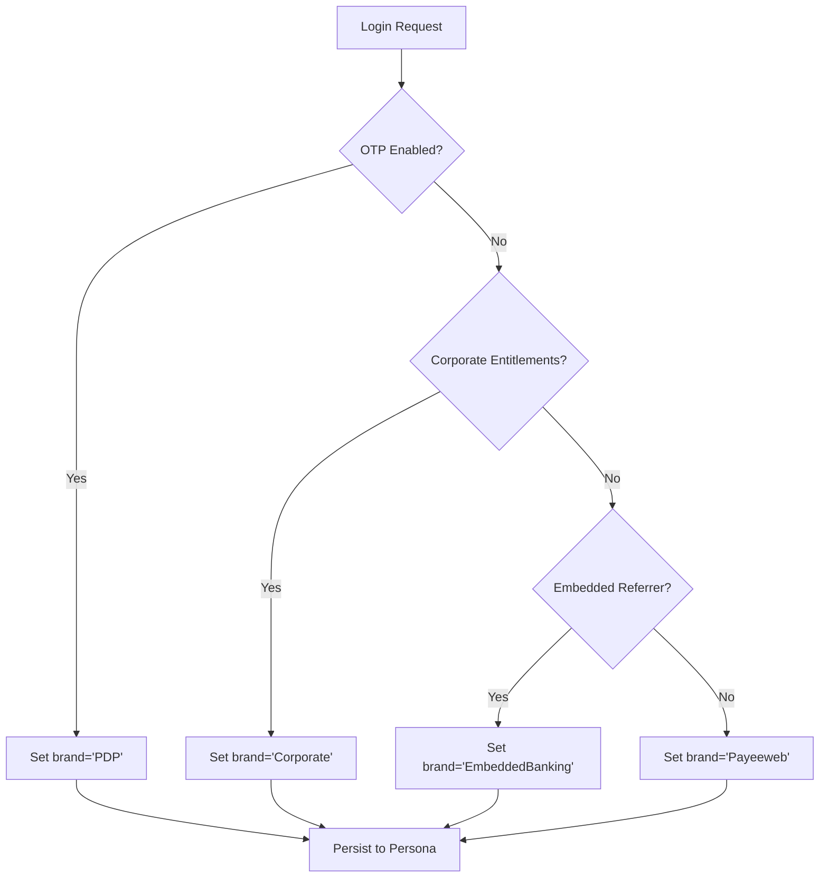
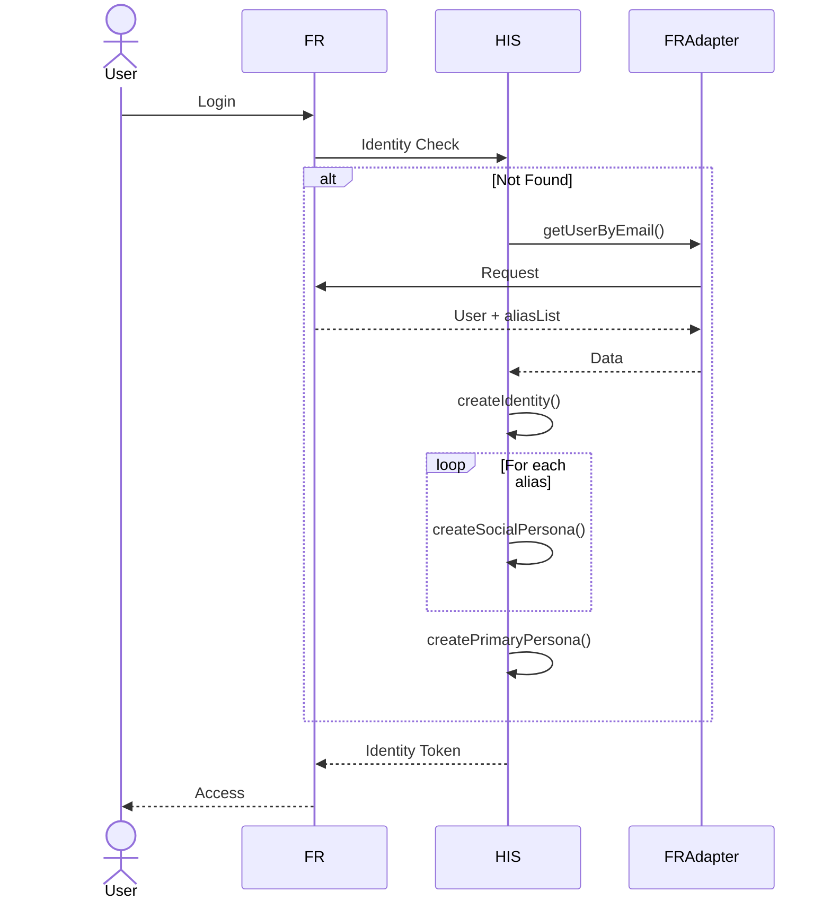
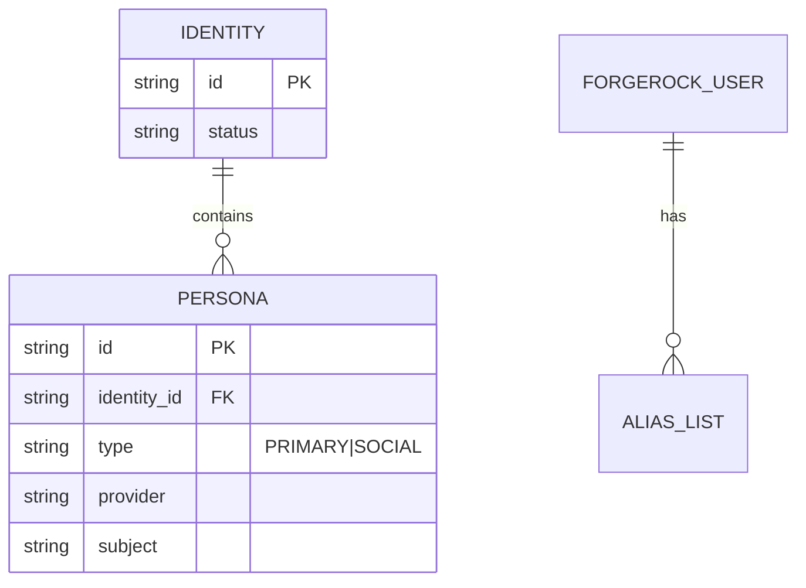
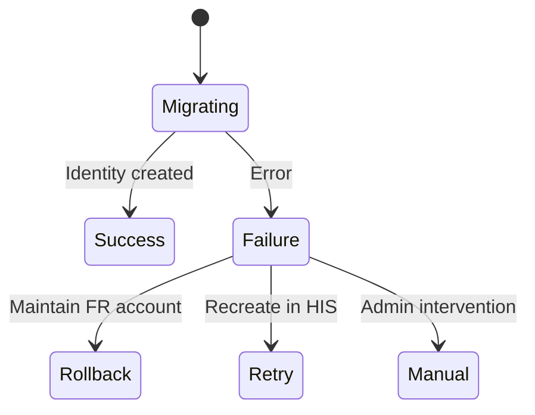
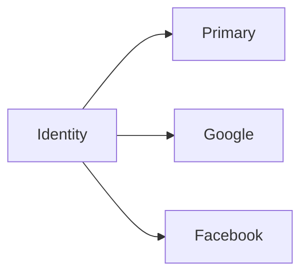

## Goals

* Establish HIS as the *single source of truth* for all identity and authentication data.
* Provide *persona-based identity modeling* with customer-specific entitlements.
* Enable *seamless migration* of users from ForgeRock (FR) to HIS.
* Preserve *identity linkages* across client brands and social providers.
* Ensure *zero downtime*, data consistency, and forward compatibility.

## Problem Statement

ForgeRock is currently the central identity provider, handling user creation, authentication, and storage. However:

* FR lacks the concept of *personas* and customer-specific entitlement isolation.
* FR is a SaaS-managed system, limiting *customization and resilience*.
* HIS offers deeper identity modeling, control over data, and supports multi-client identity relationships.

## Design Goals & Key Concerns

These are the top priorities and risks that the migration and HIS adoption must address:

1. **Journey Migration (PDP → default\_Federation)**
   Ensuring a seamless and transparent transition of login journeys for PDP users into a unified experience.

2. **HIS Data & PUPEE Profile Sync**
   HIS must not only persist PDP users' identities but also handle profile creation and syncing with PUPEE in a reliable and standardized way.

3. **Password Storage Transition**
   Migrate password storage from ForgeRock SaaS to the new authentication service.
   🔁 Option: Re-invite users with password reset to simplify the transition.

## Technical Design

### Architecture Overview

### Client Detection Logic

### Migration Workflow

### Social Account Linking

## Migration Phases

| Phase                       | Activities                                      | Success Criteria      |
| --------------------------- | ----------------------------------------------- | --------------------- |
| 1: On-the-Fly Migration     | Migrate existing users during login (PDP first) |                       |
| 2: New User Creation Direct | Direct all new users to HIS (Scotia migration)  | 100% new users in HIS |
| 3: Background Sync          | Scheduled FR→HIS sync (Corporate/Embedded)      | <1% FR-only users     |
| 4: HIS as SSOT              | Disable FR writes, redirect reads to HIS        | Zero FR writes        |
| 5: FR Decommission          | Archive FR data, remove dependencies            | Cost savings realized |

## Rollback & Fallback Plan

* **Real-Time Fallback:** For any HIS error, FR acts as a fallback for login/authentication.
* **Conflict Resolution:** HIS handles attribute merge conflicts during migration based on brand priority and last-update timestamps.
* **Observability:** Dashboards for identity migration, error tracking, and FR fallback rates will be live.

## Critical Decisions

### 4.1 Identity Resolution

| Decision                                                       | Rationale                       | Status   |
| -------------------------------------------------------------- | ------------------------------- | -------- |
| Merge duplicate emails into single HIS identity                | Prevents identity fragmentation | Approved |
| Use custom\_hasCompletedMFA + entitlements for brand detection | Accurate client context         | Proposed |

### 4.2 Security & Compliance

| Decision                                      | Rationale                         | Status            |
| --------------------------------------------- | --------------------------------- | ----------------- |
| Maintain FR as read replica during transition | Enables rollback without downtime | Approved          |
| Delete FR passwords post-migration            | Reduces attack surface            | Pending SecReview |

### 4.3 PDP Integration

| Decision                                  | Rationale                  | Status   |
| ----------------------------------------- | -------------------------- | -------- |
| HIS creates PUPEE profiles with Sentry ID | Unified profile management | Approved |
| Authentication service in PCI account     | Security isolation         | Approved |

## Open Questions

### 5.1 High Priority

| Question                                                        | Impact                   | Owner    |
| --------------------------------------------------------------- | ------------------------ | -------- |
| How to detect Corporate vs Embedded users without entitlements? | High (Persona structure) | Product  |
| Password migration strategy from FR to auth service             | Medium (User experience) | Security |
| Legal requirements for FR data retention                        | High (Compliance)        | Legal    |

### 5.2 Journey Implementation

* Should we maintain separate journeys per client or unify?
* Social login UI requirements for PDP
* Entitlement synchronization between HIS and client systems

## Follow-Up ADRs

### ADR-001: HIS as Source of Truth

* **Decision**: All identity writes route to HIS
* **Consequences**: Dual-write during transition

### ADR-002: Persona-Based Identity Model

* **Decision**: Model social identities as separate personas
* **Example:**

### ADR-003: On-the-Fly Migration

* **Decision**: Migrate during first new-journey login
* **Error Handling**: Maintain FR account on failure

## Key Metrics

* **Coverage**: 100% new users in HIS by Phase 2
* **Completeness**: 95% legacy users migrated by Phase 3
* **Consistency**: <0.1% data drift during sync
* **Performance**: <500ms auth latency

## Appendix

* HIS API Specifications
* FR Data Dictionary
* Migration Test Cases
