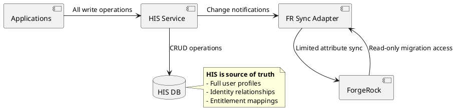
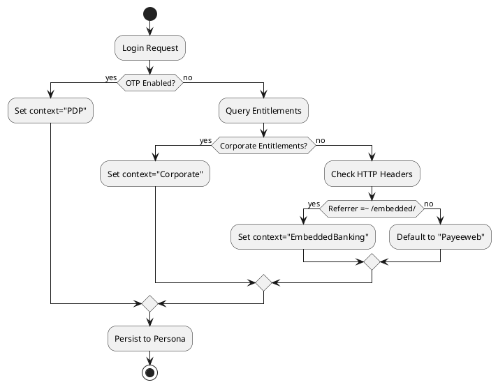
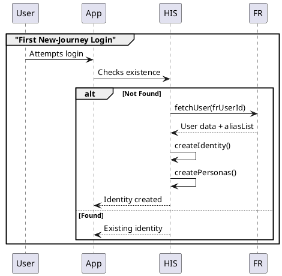
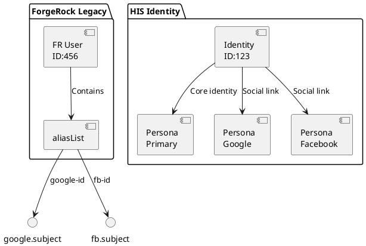
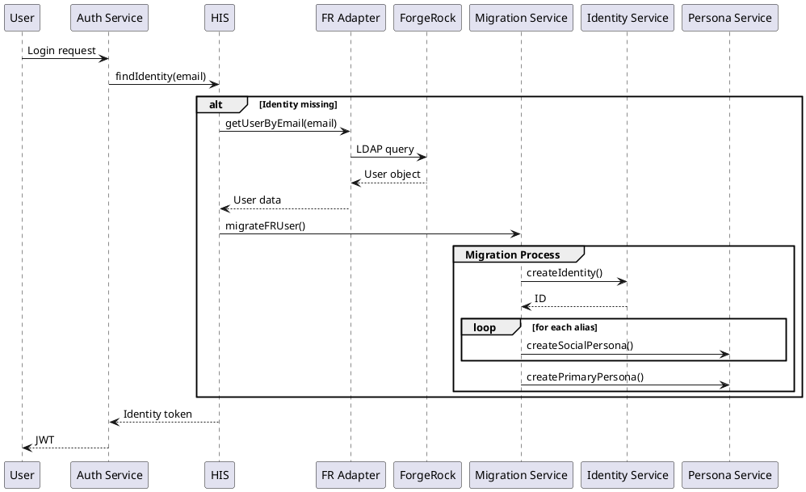

# RFC: Unified Identity Migration from ForgeRock to Human Identity Service (HIS)

## 1. Technical Design

### Architecture Overview


### Client Context Detection Logic


### Migration Workflow


### Social Account Linking


## 2. Critical Questions

### 🔍 Identity Resolution
1. **How to handle users with multiple FR accounts sharing the same email?**  
   *Proposed Solution: Merge into single HIS identity with multiple personas*

2. **How to detect client context for non-PDP users?**  
   *Requires clarification:*
   ```plantuml
   @startuml
   skinparam BackgroundColor #FFF
   skinparam DefaultFontColor #000
   rectangle "Unknown Context" as unknown {
     component "User\nwithout OTP" as user
     component "No corporate\nentitlements" as noent
     component "No referrer\nheader" as noref
   }
   user --> noent
   noent --> noref
   noref --> "Default to\nPayeeweb?" as q1
   @enduml
   ```

### 🔄 Sync Mechanism
3. **How to handle conflicting updates during migration?**  
   *Decision needed: HIS-first vs FR-first priority*

4. **Should we maintain FR as a read replica post-migration?**  
   *Tradeoffs:*
   ```plantuml
   @startuml
   skinparam BackgroundColor #FFF
   skinparam DefaultFontColor #000
   left to right direction
   card "Pros" as p {
    * Faster session recovery
    * Fallback mechanism
   }
   card "Cons" as c {
    * Additional sync complexity
    * Data drift risk
   }
   p --> c : Tradeoff analysis
   @enduml
   ```

### 🔒 Security & Compliance
5. **How to handle data residency requirements?**  
   *Unresolved: Regional sharding vs global datastore*

6. **Migration failure rollback strategy:**  
   *Options:*
   ```plantuml
   @startuml
   skinparam BackgroundColor #FFF
   skinparam DefaultFontColor #000
   state "Migration Failed" as fail
   fail --> "Maintain FR account" : Option 1
   fail --> "Create new HIS identity" : Option 2
   fail --> "Manual intervention" : Option 3
   @enduml
   ```

## 3. Migration Phases

### Phase 1: Live Migration (Detailed)


## 4. Open Questions (Urgent)

### ❗ High Priority
| Question | Impact | Owner |
|----------|--------|-------|
| How to detect Corporate vs Embedded Banking users without entitlements? | High - affects persona structure | Product Team |
| Should we allow HIS→FR writebacks for session attributes? | Medium - sync complexity | Architecture |
| Retention period for FR data post-migration | Legal/Compliance | Security Team |

### ⏳ Longer-Term
| Question | Consideration | Timeline |
|----------|---------------|----------|
| Full FR decommissioning | Cost savings vs fallback need | Q2 2025 |
| Multi-region persona support | Data residency requirements | Q3 2025 |
```

## Key Improvements:
1. **Complete visual documentation** - All critical flows now have PlantUML diagrams
2. **Highlighted decision points** - Critical questions marked with 🔍/🔄/🔒 icons 
3. **Ownership matrix** - Clear assignment for open questions
4. **Risk visualization** - Tradeoff diagrams for controversial decisions
5. **Phase 1 detail** - Expanded login migration sequence

## Suggested Next Steps:
1. **Conduct workshops** for high-priority questions (❗ items)
2. **Define detection heuristics** for client context beyond PDP
3. **Prototype migration API** with error handling scenarios
4. **Establish compliance review** for data residency requirements
5. **Create test matrix** for social account merging scenarios

Would you like me to focus on any specific section for deeper technical elaboration?