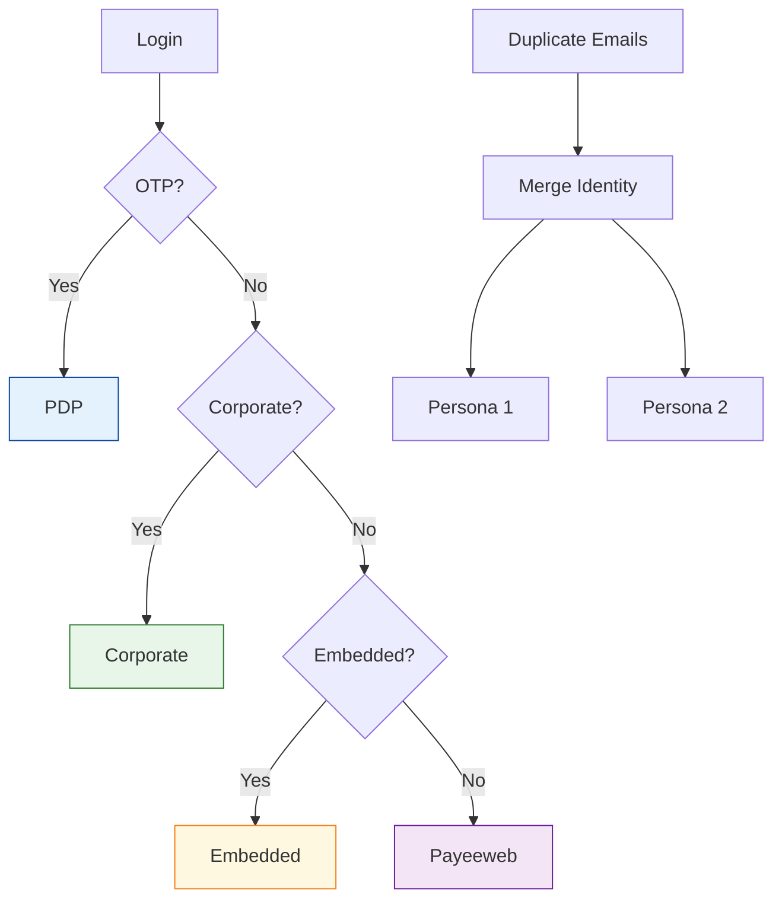
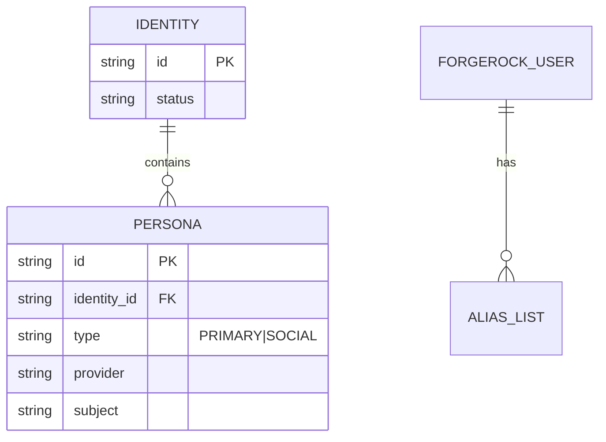
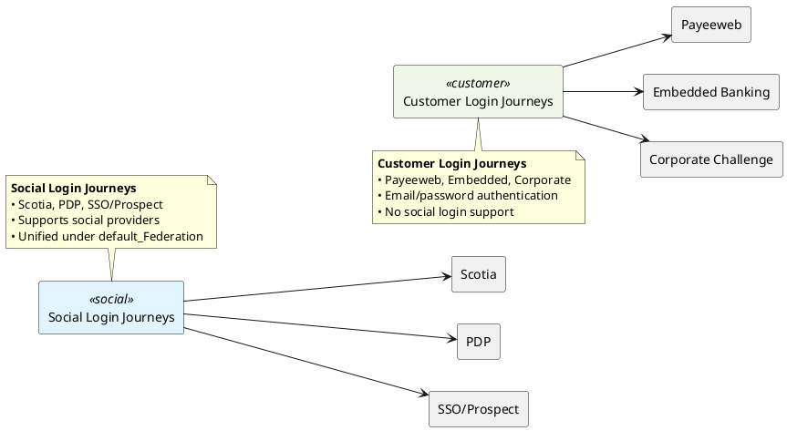
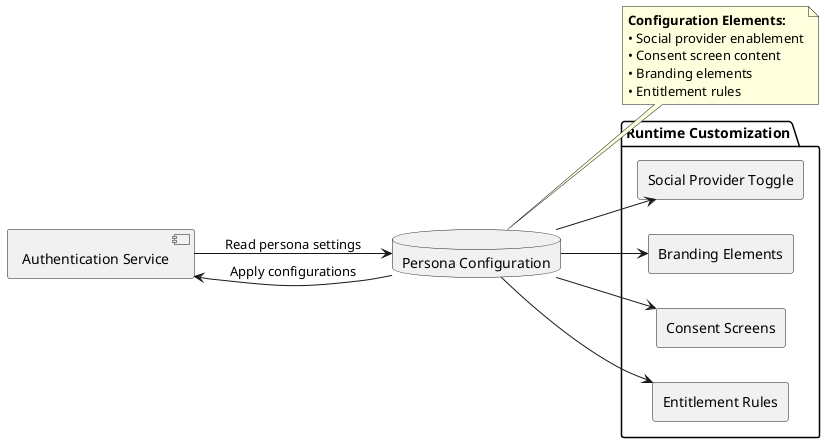
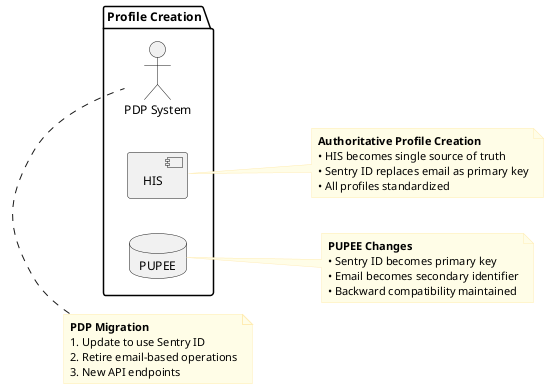
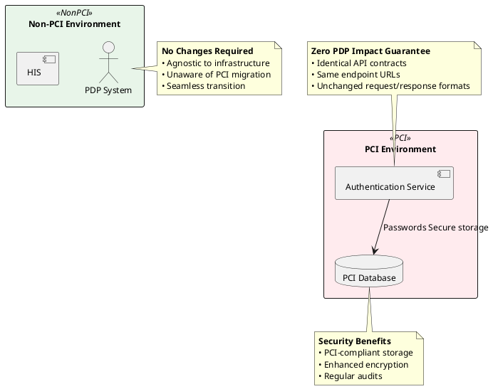
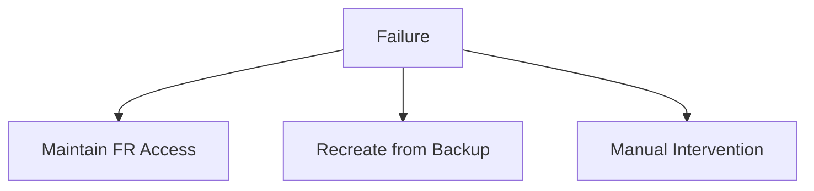

# RFC: Migration to Human Identity Service as Source of Truth

## 1. Introduction

### Goals

- Establish HIS as single source of truth for identity data
- Implement persona-based identity modeling
- Enable seamless migration from ForgeRock (FR)
- Preserve identity linkages across brands
- Ensure zero downtime and data consistency
- Transition password storage to authentication service

### Problem Statement

FR limitations:

- No persona-based identity modeling
- SaaS model limits customization
- Inadequate entitlement isolation
- No unified social identity linking
- Password storage in third-party SaaS

## 2. Technical Design

### 2.1 Core Architecture


### 2.2 Brand Detection & Identity Resolution

- Primary method: `custom_hasCompletedMFA` parameter
- Fallback: Client-provided user lists
- Detection priority: OTP > entitlements > referrer > default



### 2.3 Migration Workflow


### 2.4 Social Account Linking



### 2.5 Journey Classification



### 2.6 Journey Unification Timeline

```plantuml
@startuml
left to right direction

rectangle "Current State" as current
rectangle "Phase 1" as phase1
rectangle "Phase 2" as phase2
rectangle "Phase 3" as phase3
rectangle "Milestone 1" as m1
rectangle "Milestone 2" as m2
rectangle "Milestone 3" as m3

current --> phase1
phase1 --> phase2
phase2 --> phase3
phase1 --> m1
phase1 --> m2
phase3 --> m3

note top of current
  <b>Current State (2023 Q4)</b>
  • Separate journeys
  • Social: Scotia, PDP, SSO
  • Customer: Payeeweb, Embedded, Corporate
end note

note top of phase1
  <b>Phase 1 (2024 Q1)</b>
  • Migrate Scotia
  • Migrate PDP
  • Migrate SSO
end note

note top of phase2
  <b>Phase 2 (2024 Q2-Q3)</b>
  • Payeeweb migration
  • Embedded Banking
  • Corporate Challenge
end note

note top of phase3
  <b>Phase 3 (2024 Q4)</b>
  • Single configurable flow
  • Persona-based customization
end note

note bottom of m1
  <b>Milestone: PDP Migrated</b>
  2024-03-01
end note

note bottom of m2
  <b>Milestone: Social Complete</b>
  2024-04-01
end note

note bottom of m3
  <b>Milestone: Full Unification</b>
  2024-12-31
end note
@enduml```

#### Journey Unification Roadmap
```plantuml
@startuml
gantt
  title Journey Unification Timeline
  dateFormat  YYYY-MM-DD
  axisFormat  %b %Y
  
  [Current State] : 2023-11-01, 60d
  section Phase 1
  Social unification : active, after end, 90d
  section Phase 2
  Customer adoption : after Social unification, 90d
  section Future State
  Unified configurable journey : after Customer adoption, 0d
  section Milestones
  PDP migration complete : milestone, 2024-01-31, 0d
  All brands on default_Federation : milestone, 2024-06-30, 0d
  Full unification : milestone, 2024-12-31, 0d
@enduml
```

#### 2.7 Customization Points



- **Missing UI screens for mandatory social user data**

## 3. Conflict Resolution

### Resolution Principles

1. **HIS is SSOT**: Wins for core identity attributes
2. **FR Priority**: Wins for session-related attributes
3. **Version Control**: Timestamp-based conflict detection
4. **Attribute-specific Rules**: Different resolution per parameter type


## 4. PDP Integration

### 4.1 Profile Creation



### 4.2 PCI Migration

PDP should be agnostic to that, we should avoid having to do a migration twice from FR-SaaS to authentication service on
Non-PCI and then from Non-PCI to PCI.



[//]: # (### Workflow)

[//]: # ()

[//]: # (1. Transition period: HIS and PDP both create profiles)

[//]: # (2. HIS becomes exclusive creator)

[//]: # (3. Final state: PDP uses HIS-created profiles exclusively)

## 5. Migration Strategy

### 5.1 Phased Approach

[//]: # (```mermaid)

[//]: # (gantt)

[//]: # (    title Migration Timeline)

[//]: # (    dateFormat YYYY-MM-DD)

[//]: # (    section Phase 1)

[//]: # (        Live Migration: active, p1, 2024-01-01, 30d)

[//]: # (    section Phase 2)

[//]: # (        New Users: p2, after p1, 30d)

[//]: # (    section Phase 3)

[//]: # (        Background Sync: p3, after p2, 30d)

[//]: # (```)

| Phase                  | Activities                             | Brand Specific |
|------------------------|----------------------------------------|----------------|
| **1: Live Migration**  | Migrate users during login (PDP first) | Yes            |
| **2: New Users**       | Direct new users to HIS                | Yes            |
| **3: Background Sync** | Scheduled FR→HIS sync                  | Yes            |
| **4: HIS as SSOT**     | Disable FR writes                      | No             |
| **5: Decommission**    | Archive FR data                        | No             |

### 5.2 Key Workflows

#### Password Migration

- On-demand reset during login
- New passwords stored in authentication service
  ```mermaid
  journey
   title Password Transition
   section User
   Login: 5
   Reset Prompt: 5
   Set Password: 5
   section System
   Store in Auth Service: 5
   Delete from FR: 5
  ```

#### Failure Handling:



- **FR passwords: Delete immediately post-migration**

## 6. Decision FAQ

| Question                                                                  | Decision                                                      | Rationale                                                                                                      | Implementation                                                                 |
|---------------------------------------------------------------------------|---------------------------------------------------------------|----------------------------------------------------------------------------------------------------------------|--------------------------------------------------------------------------------|
| **How to handle users with multiple FR accounts sharing the same email?** | Merge into single HIS identity with multiple personas         | Prevents identity fragmentation<br>Preserves all entitlements<br>Maintains access across all original accounts | Automated merge during migration<br>Admin notification for manual verification |
| **Should we allow HIS → FR writebacks for session attributes?**           | No writebacks                                                 | Enables safe rollback<br>Prevents synchronization conflicts<br>Maintains FR as read-only during transition     | Block all write operations to FR<br>Audit any attempted writebacks             |
| **Do we need to delete FR data post-migration?**                          | Delete passwords immediately<br>Purge aliasList after 30 days | Security compliance (passwords in SaaS)<br>Reduce attack surface<br>Privacy regulations (PII minimization)     | Automated scrubbing jobs<br>Verification audits<br>Compliance documentation    |

## 7. Follow-Up ADRs

### ADR-001: HIS as Source of Truth

- All identity writes route to HIS
- FR becomes read-only during transition

### ADR-002: Persona-Based Identity

- Social identities as separate personas
- Single identity for consolidated management

### ADR-003: Password Migration

- On-demand reset during login
- No bulk password transfers