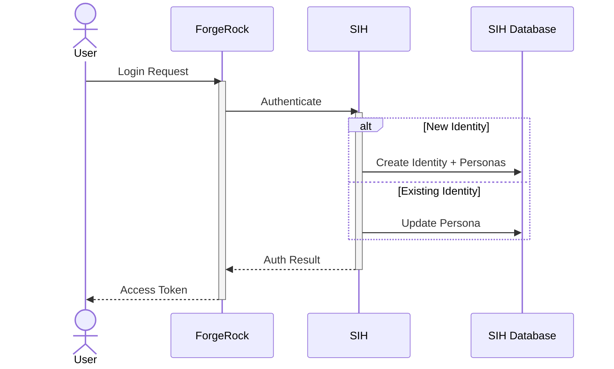
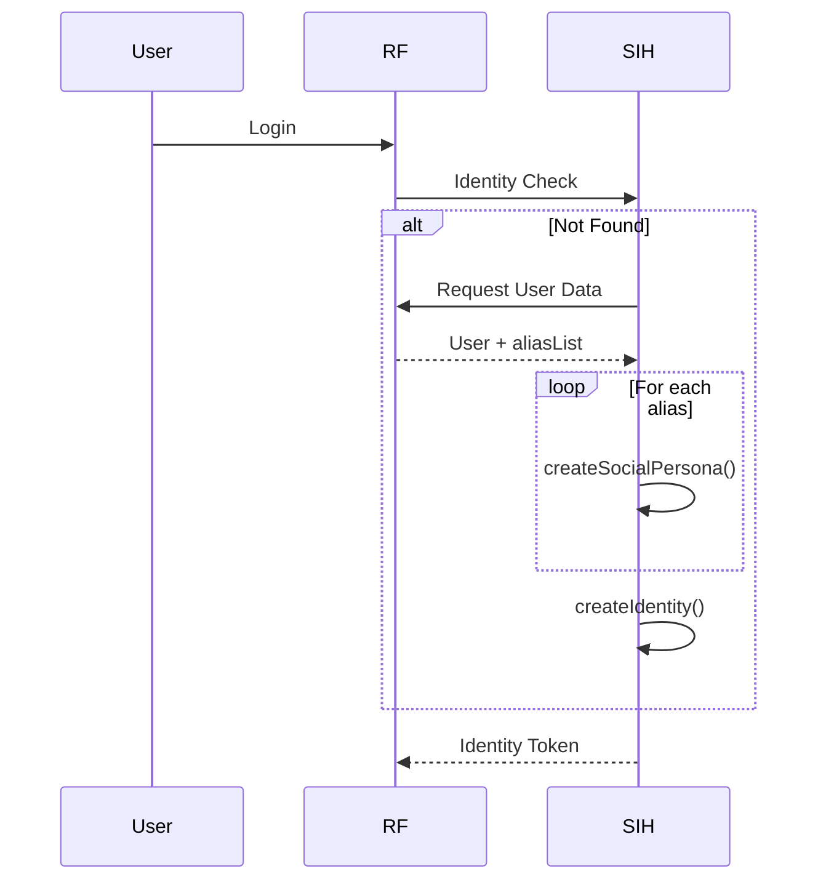
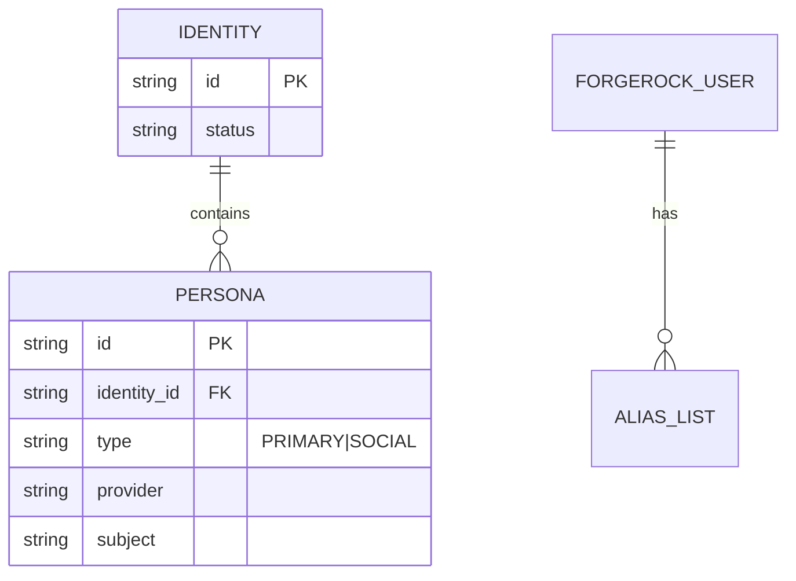
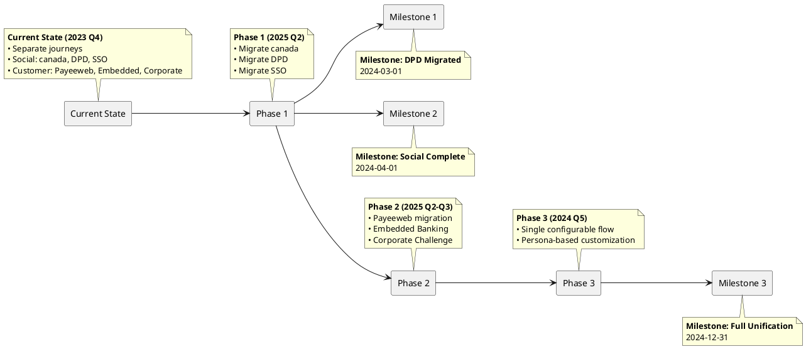
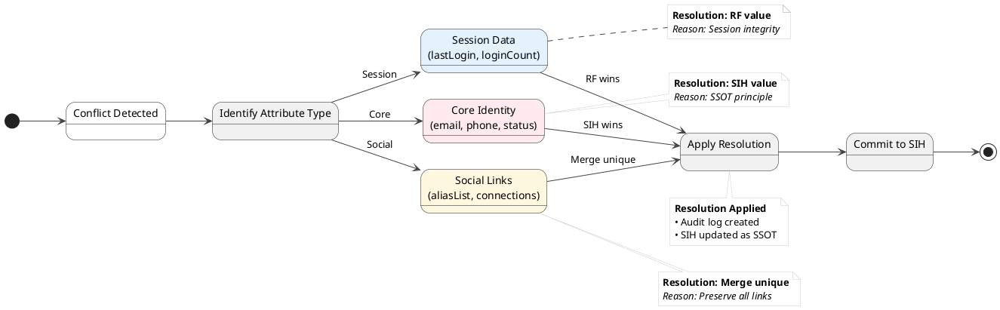
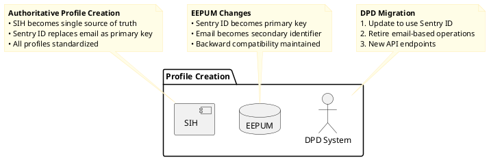

# RFC: Migration to Human Identity Service as Source of Truth

## 1. Introduction

### Goals

- Establish SIH as single source of truth for identity data
- Implement persona-based identity modeling
- Enable seamless migration RFom ForgeRock (RF)
- Preserve identity linkages across brands
- Ensure zero downtime and data consistency
- Transition password storage to authentication service

### Problem Statement

RF limitations:

- No persona-based identity modeling
- SaaS model limits customization
- Inadequate entitlement isolation
- No unified social identity linking
- Password storage in third-party SaaS

## 2. Technical Design

### 2.1 Core Architecture



### 2.2 Brand Detection & Identity Resolution

- Primary method: `custom_hasCompletedMFA` parameter
- Fallback: Client-provided user lists
- Detection priority: OTP > entitlements > referrer > default


### 2.3 Migration Workflow



### 2.4 Social Account Linking



### 2.5 Journey Classification


### 2.6 Journey Unification Timeline
- We start with DPD because of minimal risk & least number of users RFom all our customers


#### 2.7 Customization Points

- **Missing UI screens for mandatory social user data**

## 3. Conflict Resolution

### Resolution Principles

1. **SIH is SSOT**: Wins for core identity attributes
2. **RF Priority**: Wins for session-related attributes
3. **Version Control**: Timestamp-based conflict detection
4. **Attribute-specific Rules**: Different resolution per parameter type



## 4. DPD Integration

### 4.1 Profile Creation



### 4.2 PCI Migration

- We need to move Authentication service to PCI
- DPD should be agnostic to that
- We should avoid having to do a migration on:
    - Non-PCI
    - then RFom Non-PCI to PCI.

[//]: # (### Workflow)

[//]: # ()

[//]: # (1. Transition period: SIH and DPD both create profiles)

[//]: # (2. SIH becomes exclusive creator)

[//]: # (3. Final state: DPD uses SIH-created profiles exclusively)

## 5. Migration Strategy

### 5.1 Phased Approach

[//]: # (```mermaid)

[//]: # (gantt)

[//]: # (    title Migration Timeline)

[//]: # (    dateFormat YYYY-MM-DD)

[//]: # (    section Phase 1)

[//]: # (        Live Migration: active, p1, 2024-01-01, 30d)

[//]: # (    section Phase 2)

[//]: # (        New Users: p2, after p1, 30d)

[//]: # (    section Phase 3)

[//]: # (        Background Sync: p3, after p2, 30d)

[//]: # (```)

| Phase                  | Activities                                              | Brand Specific |
|------------------------|---------------------------------------------------------|----------------|
| **1: Live Migration**  | Migrate users on the fly during login (DPD first)       | Yes            |
| **2: New Users**       | Direct new users to SIH                                 | Yes            |
| **3: Background Sync** | Run migration RF→SIH sync                               | Yes            |
| **4: SIH as SSOT**     | All write/read operations move to SIH                   | No             |
| **5: Decommission**    | Archive RF data agter all brand users has been migrated | No             |

### 5.2 Key Workflows

#### Password Migration

- On-demand reset during login
- New passwords stored in authentication service
- RF passwords: Delete immediately post-migration.

[//]: # ()

[//]: # (  ```mermaid)

[//]: # (  journey)

[//]: # (   title Password Transition)

[//]: # (   section User)

[//]: # (   Login: 5)

[//]: # (   Reset Prompt: 5)

[//]: # (   Set Password: 5)

[//]: # (   section System)

[//]: # (   Store in Auth Service: 5)

[//]: # (   Delete RFom RF: 5)

[//]: # (  ```)

#### Failure Handling:


## 6. Decision FAQ

| Question                                                                  | Decision                                                 | Rationale                                                                                                      | Implementation                                                                 |
|---------------------------------------------------------------------------|----------------------------------------------------------|----------------------------------------------------------------------------------------------------------------|--------------------------------------------------------------------------------|
| **How to handle users with multiple RF accounts sharing the same email?** | Merge into single SIH identity with multiple personas    | Prevents identity RFagmentation<br>Preserves all entitlements<br>Maintains access across all original accounts | Automated merge during migration<br>Admin notification for manual verification |
| **Should we allow SIH → RF writebacks in case of a conflict?**            | No writebacks                                            | Enables safe rollback<br>Prevents synchronization conflicts                                                    | Maintains RF as read-only during transition except for session details.        |
| **Do we need to delete RF data post-migration?**                          | Delete passwords immediately.<br>Might delete aliasList. | Protect our users passwords                                                                                    | Delete job                                                                     |

## 7. Follow-Up ADRs

### ADR-001: SIH as Source of Truth

- All identity writes route to SIH
- RF becomes read-only during transition

### ADR-002: Persona-Based Identity

- Social identities as separate personas
- Single identity for consolidated management

### ADR-003: Password Migration

- On-demand reset during login
- No bulk password transfers